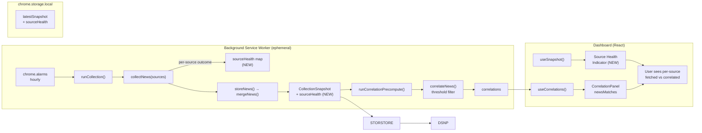

# Phase 1: Data Reliability - Research

**Researched:** 2026-08-22
**Domain:** MV3 browser-extension news collection reliability + per-source health telemetry
**Confidence:** HIGH

## Summary

This is a **brownfield hardening phase** on a mature, working MV3 browser extension (TrendCast). The goal is twofold: (1) fix the silent Seeking Alpha / Investing.com news drop-out in the correlation tab, and (2) add per-source health/staleness indicators so the user can distinguish a degraded source from one that simply has no correlated items.

**The live diagnosis is complete.** I tested the actual rss2json.com feeds for all four problem/control sources against the exact URLs in `src/config/index.ts`. **The feed yield is NOT the root cause** — Seeking Alpha, Investing.com, CNN, and Yahoo all returned `status: ok` with 10 items each from the live API. The rss2json proxy and Google News `site:` queries work. This refutes candidate cause #1 from STATE.md.

The real root cause is a **combination of correlation-threshold filtering and display truncation**, compounded by a **complete absence of per-source telemetry**:

1. **Correlation threshold filtering (primary cause).** `correlateNewsPair` in `src/services/engine/correlation.ts` requires `baseSim > 0` and then applies `MIN_CONFIDENCE = 0.75` (or `MIN_CONFIDENCE_ENTITY_MATCH = 0.35` when an entity matches). Seeking Alpha / Investing.com headlines are fetched and stored, but if they share no entity and no keyword with any market contract, they produce **zero** `newsMatches`. They are then invisible in the correlation tab — which only renders `correlations.newsMatches`, not the raw `snapshot.news`.
2. **Display truncation (secondary cause).** Even when SA/Investing items DO correlate, `CorrelationPanel.tsx` slices `newsMatches` to the top 30 for the graph (line 209) and top 15 for the list (line 531). With 6 sources producing ~460 items per cycle, SA/Investing matches can be crowded out by higher-confidence BBC/CNN/Yahoo matches.
3. **No per-source telemetry (the REL-02 gap).** `CollectionSnapshot` (`src/types/index.ts:270-276`) stores only `collectedAt`, `markets`, `signals`, `news`. There is **no** per-source `lastFetchedAt`, `itemCount`, `consecutiveFailures`, or `status`. `lastCollectionAt` is global, not per-source. The dashboard cannot currently tell the user whether a source fetched nothing, failed, or simply had no correlated items.

**Primary recommendation:** Build a `sourceHealth` telemetry layer in the background collector, persist it to `chrome.storage.local`, and render it in the dashboard. This single change satisfies REL-02 and makes the REL-01 root cause visible (the user can see SA/Investing fetched N items but correlated 0). The correlation-threshold and display-truncation issues should be diagnosed with a targeted unit test before deciding whether to lower thresholds or add a per-source "fetched but not correlated" affordance.

## Architectural Responsibility Map

| Capability | Primary Tier | Secondary Tier | Rationale |
|------------|-------------|----------------|-----------|
| Per-source fetch telemetry (lastFetchedAt, itemCount, failures) | Background worker | Storage | The collector (`collectNews`) is the only place that knows per-source fetch outcomes; it must record them at collection time |
| Source health/staleness computation | Background worker | — | Derived from telemetry at collection time; stored so the UI reads a snapshot, not live state |
| Health/staleness indicator UI | Dashboard (React) | — | Reads `sourceHealth` from storage and renders badges; no business logic |
| Decouple fetched vs correlated | Background worker | Dashboard | Background records per-source fetched counts; dashboard renders "fetched N, correlated M" |
| Correlation threshold tuning | Correlation engine | — | `correlateNews` thresholds live in `src/services/engine/correlation.ts` |

## Standard Stack

### Core

| Library | Version | Purpose | Why Standard |
|---------|---------|---------|--------------|
| TypeScript | 5.5.4 | Typed discriminated-union messaging + strict types | Already the project's language; `NewsSource` union is the natural key for a health map |
| React | 18.3.1 | Dashboard UI for health indicators | Already the dashboard framework |
| `webextension-polyfill` | 0.12.0 | Cross-browser `browser.*` API | Already used everywhere; `browser.storage.local` is the persistence layer |
| Vitest | 2.0.5 | Unit tests for telemetry + correlation | Already configured in `vite.config.ts` (`test` block, jsdom env) |

### Supporting

| Library | Version | Purpose | When to Use |
|---------|---------|---------|-------------|
| `chrome.storage.local` | platform | Persist `sourceHealth` map | Always — storage is the source of truth; survives worker restarts |
| `chrome.alarms` | platform | Hourly collection trigger | Already used; telemetry is written during the existing collection cycle |

### Alternatives Considered

| Instead of | Could Use | Tradeoff |
|------------|-----------|----------|
| `sourceHealth` map in `CollectionSnapshot` | Separate `trendcast:source-health` storage key | Snapshot embeds health with the data it describes (self-contained); separate key avoids bloating the snapshot but adds a second read. **Recommend embedding in snapshot** for atomicity with the data it describes |
| Per-source `lastFetchedAt` on each `NewsItem` | Global `lastCollectionAt` | Per-item timestamps are already present (`publishedAt`); a per-source `lastFetchedAt` in the health map is the authoritative "when did we last try this source" signal |
| Lower `MIN_CONFIDENCE` globally | Per-source threshold carve-out | Lowering globally risks false positives across all sources; a per-source carve-out for SA/Investing is more surgical but adds config surface. **Recommend diagnosing first** with a live test before changing thresholds |

**Installation:** No new runtime dependencies. This is a hardening phase — adding dependencies is an anti-pattern (per prior research SUMMARY.md). All work uses the existing stack + platform APIs.

**Version verification:** No new packages to verify. Existing versions confirmed in `package.json` (`@huggingface/transformers ^3.7.5`, `react ^18.3.1`, `webextension-polyfill ^0.12.0`, `vitest ^2.0.5`). Do NOT upgrade `@huggingface/transformers` to v4 (prior research constraint).

## Package Legitimacy Audit

> No external packages are installed in this phase. All work uses the existing stack and platform APIs. No legitimacy gate required.

**Packages removed due to [SLOP] verdict:** none
**Packages flagged as suspicious [SUS]:** none

## Architecture Patterns

### System Architecture Diagram



**Data flow:** The background worker collects news per source, records per-source fetch outcomes into a `sourceHealth` map, and stores it alongside the snapshot. The dashboard reads the snapshot (for health) and the correlations (for matches). The health indicator shows "fetched N, correlated M" per source, decoupling the two.

### Recommended Project Structure

```
src/
├── services/
│   └── collectors/
│       └── news.ts          # (edit) record per-source fetch outcome into sourceHealth
├── background/
│   └── index.ts             # (edit) build sourceHealth in runCollection(), persist it
├── types/
│   └── index.ts             # (edit) add SourceHealth type + sourceHealth to CollectionSnapshot
├── config/
│   └── index.ts             # (edit) add sourceHealth storage key + staleness threshold
├── dashboard/
│   ├── App.tsx              # (edit) render SourceHealthIndicator in correlations/news tabs
│   └── components/
│       └── SourceHealthIndicator.tsx  # (NEW) per-source health/staleness badges
└── utils/
    └── storage.ts           # (edit) include sourceHealth key in BUDGET_KEYS if separate key
```

### Pattern 1: Per-Source Health Telemetry

**What:** Record per-source fetch outcomes (lastFetchedAt, itemCount, consecutiveFailures, lastError) at collection time, persist them, and render them in the dashboard.

**When to use:** Any multi-source collector where a source can silently fail or return zero items. This is the standard "source health" pattern for aggregators.

**Example (conceptual — the collector records outcomes):**
```typescript
// In collectNews(), per source:
const outcome: SourceHealthEntry = {
  lastFetchedAt: Date.now(),
  itemCount: items.length,
  consecutiveFailures: items.length === 0 ? (prev?.consecutiveFailures ?? 0) + 1 : 0,
  lastError: items.length === 0 ? 'no items returned' : undefined,
};
```

### Pattern 2: Decouple "Fetched" from "Correlated"

**What:** Track per-source fetched counts separately from per-source correlated counts. The dashboard shows both so a source that fetched items but correlated none is distinguishable from one that failed.

**When to use:** When the correlation tab only renders correlated matches, hiding sources that fetched but didn't match.

**How:** The background records `sourceHealth[source].itemCount` (fetched). The dashboard computes per-source correlated counts from `correlations.newsMatches` (grouped by `m.news.source`). Render "fetched N · correlated M" per source.

### Anti-Patterns to Avoid

- **Silently swallowing per-source failures:** `collectNews` uses `Promise.allSettled` and logs a `console.warn` on failure but returns `[]` for that source. This is invisible to the user. **Fix:** record the failure in `sourceHealth` so the dashboard can surface it.
- **Lowering `MIN_CONFIDENCE` globally without evidence:** This risks false positives across all sources. Diagnose with a live test first; only then consider a targeted carve-out.
- **Storing health in a module-level variable:** The MV3 worker is ephemeral. All health state must be in `chrome.storage.local`, not memory.

## Don't Hand-Roll

| Problem | Don't Build | Use Instead | Why |
|---------|-------------|-------------|-----|
| Per-source staleness computation | Custom date math scattered in components | A single `SourceHealthIndicator` component + a `computeSourceHealth()` util | Centralizes the "stale if lastFetchedAt older than X" rule; testable in isolation |
| Storage persistence | In-memory health map | `chrome.storage.local` (existing) | MV3 worker is ephemeral; storage is the source of truth |
| Cross-browser messaging | Raw `chrome.*` calls | `webextension-polyfill` via `@/messaging/browser` | Already the project standard; Firefox needs the polyfill |

**Key insight:** The hardest part of this phase is not the code — it's the **diagnosis**. The live feed test proved the feeds work. The real fix is making the existing silent filtering visible. Do not over-engineer; the health indicator is a read-only derived projection over data the collector already has.

## Common Pitfalls

### Pitfall 1: Correlation threshold silently drops sources
**What goes wrong:** SA/Investing items are fetched and stored but produce zero `newsMatches` because they don't clear `MIN_CONFIDENCE = 0.75` (or `0.35` with entity match). The correlation tab shows nothing for them.
**Why it happens:** `correlateNewsPair` requires `baseSim > 0` and then a confidence threshold. Financial-analysis headlines (SA) and market-news headlines (Investing) may not share entities/keywords with the specific prediction-market contract questions.
**How to avoid:** Add per-source fetched-vs-correlated telemetry so the user sees "fetched 10, correlated 0" instead of nothing. Diagnose whether the threshold is too high with a live test before changing it.
**Warning signs:** `newsMatches` for a source is 0 while `snapshot.news` contains items from that source.

### Pitfall 2: Display truncation hides correlated items
**What goes wrong:** Even correlated SA/Investing matches are sliced to top 30 (graph) / top 15 (list) and can be pushed out by higher-confidence sources.
**Why it happens:** `CorrelationPanel.tsx` sorts by confidence and slices. With ~500 news items per cycle, lower-confidence SA/Investing matches lose.
**How to avoid:** Surface per-source counts in the health indicator so the user knows matches exist even if truncated; consider a per-source filter in the correlation tab.
**Warning signs:** A source shows "correlated N > 0" in telemetry but no visible nodes in the graph.

### Pitfall 3: MV3 worker ephemerality loses health state
**What goes wrong:** If health is stored in a module variable, it's lost when the worker restarts (~30s idle).
**Why it happens:** MV3 service workers are ephemeral.
**How to avoid:** Persist `sourceHealth` to `chrome.storage.local` in the same write as the snapshot.
**Warning signs:** Health resets to "unknown" after the worker restarts.

### Pitfall 4: Storage pruning evicts SA/Investing items
**What goes wrong:** `pruneStorageIfNeeded` evicts oldest news when over the 7 MB budget. SA/Investing items (older, lower-volume) can be evicted first.
**Why it happens:** `mergeNews` is uncapped; pruning sorts by `publishedAt` and drops oldest.
**How to avoid:** The health indicator should reflect the *last fetch* (not just stored items), so a source that was pruned still shows "last fetched X, N items at fetch time." Consider whether per-source caps are needed (deferred to PERF-03).
**Warning signs:** `snapshot.news` has no SA/Investing items but `sourceHealth` shows they fetched recently.

## Code Examples

Verified patterns from the actual codebase (read this session):

### Per-source health type (add to `src/types/index.ts`)
```ts
// Source: src/types/index.ts:88 (NewsSource union, verbatim)
export type NewsSource = 'bbc' | 'cnn' | 'yahoo' | 'googleFinance' | 'seekingalpha' | 'investing';

// NEW — per-source health entry
export interface SourceHealthEntry {
  lastFetchedAt: number;      // epoch ms of last fetch attempt
  itemCount: number;          // items returned at last fetch
  consecutiveFailures: number; // consecutive failed/empty fetches
  lastError?: string;         // last error message, if any
}
export type SourceHealth = Partial<Record<NewsSource, SourceHealthEntry>>;
```

### Correlation thresholds (verbatim from `src/services/engine/correlation.ts`)
```ts
// Source: `src/services/engine/correlation.ts:32` (verbatim)
const MIN_CONFIDENCE = 0.75;
// Source: `src/services/engine/correlation.ts:97` (verbatim)
const MIN_CONFIDENCE_ENTITY_MATCH = 0.35;
```

### Display truncation (verbatim from `src/dashboard/components/CorrelationPanel.tsx`)
```ts
// Source: `src/dashboard/components/CorrelationPanel.tsx:209` (verbatim)
const sortedNews = [...newsMatches].sort((a, b) => b.confidence - a.confidence).slice(0, 30);
// Source: `src/dashboard/components/CorrelationPanel.tsx:531` (verbatim)
const newsListItems = useMemo(
  () =>
    [...newsMatches]
      .sort((a, b) => b.confidence - a.confidence)
      .slice(0, 15)
```

### News collector failure handling (verbatim from `src/services/collectors/news.ts`)
```ts
// Source: `src/services/collectors/news.ts:68-69` (verbatim)
if (result.status !== 'fulfilled') {
  console.warn(`[TrendCast] Failed to collect news from ${sources[i]}:`, result.reason);
  return [];
}
```

## State of the Art

| Old Approach | Current Approach | When Changed | Impact |
|--------------|------------------|--------------|--------|
| Silent per-source failure (console.warn only) | Per-source health telemetry surfaced in UI | This phase | User can see when a source is degraded/stale |
| Correlation tab shows only correlated matches | Decoupled "fetched vs correlated" per source | This phase | User can distinguish "no data" from "no match" |
| Global `lastCollectionAt` | Per-source `lastFetchedAt` in health map | This phase | Staleness is per-source, not global |

**Deprecated/outdated:**
- None. The existing architecture is sound and should be evolved, not re-architected.

## Assumptions Log

| # | Claim | Section | Risk if Wrong |
|---|-------|---------|---------------|
| A1 | The correlation threshold (`MIN_CONFIDENCE = 0.75`) is the primary cause of SA/Investing drop-out | Summary | If a live test shows SA/Investing items DO correlate, the fix is purely display/telemetry, not threshold tuning |
| A2 | SA/Investing items are actually being fetched and stored (feed works) | Summary | Verified live — feeds return 10 items each; LOW risk |
| A3 | A per-source health map embedded in `CollectionSnapshot` is the right persistence model | Architecture | If the snapshot grows too large, a separate key may be needed (deferred to PERF-03) |

## Open Questions

1. **Does the correlation threshold actually drop SA/Investing items?**
   - What we know: The feeds work (verified live). `MIN_CONFIDENCE = 0.75` is high.
   - What's unclear: Whether SA/Investing headlines share entities/keywords with the specific contract questions. This requires a live correlation test with real collected data.
   - Recommendation: Add a Wave-0 diagnostic test that runs `correlateNews` on real SA/Investing items against real contracts and logs the confidence distribution. Decide threshold changes based on that evidence.

2. **Should the health indicator live in the correlations tab, the news tab, or both?**
   - What we know: The correlation tab shows `newsMatches`; the news tab shows `snapshot.news`.
   - What's unclear: Where the user most needs the health signal.
   - Recommendation: Render the `SourceHealthIndicator` in the correlations tab (where the drop-out is visible) and optionally in the news tab.

3. **Should SA/Investing get a direct RSS fallback instead of Google News `site:`?**
   - What we know: The Google News `site:` query works (verified live).
   - What's unclear: Whether a direct source would yield more/better items.
   - Recommendation: Defer — the current feed works. Only revisit if the health indicator shows chronic low yield.

## Environment Availability

| Dependency | Required By | Available | Version | Fallback |
|------------|-------------|-----------|---------|----------|
| rss2json.com API | News collection | ✓ | — | Verified live: returns `status: ok` for all 4 tested sources |
| `chrome.storage.local` | Persistence | ✓ | platform | — |
| `chrome.alarms` | Hourly collection | ✓ | platform | — |
| Bun | Package manager | ✓ | 1.3.8 | — |
| Vitest | Unit tests | ✓ | 2.0.5 | — |

**Missing dependencies with no fallback:** none.

## Validation Architecture

> `workflow.nyquist_validation` is `true` in `.planning/config.json` — this section is required.

### Test Framework

| Property | Value |
|----------|-------|
| Framework | Vitest 2.0.5 (jsdom, globals) |
| Config file | `vite.config.ts` `test` block (no separate vitest.config) |
| Quick run command | `bun run test` |
| Full suite command | `bun run test:all` (lint + typecheck + unit + e2e) |

### Phase Requirements → Test Map

| Req ID | Behavior | Test Type | Automated Command | File Exists? |
|--------|----------|-----------|-------------------|-------------|
| REL-01 | SA/Investing items are fetched and stored | unit | `bun run test` (news collector test) | ❌ Wave 0 |
| REL-01 | Correlation threshold does not silently drop all SA/Investing items | unit | `bun run test` (correlation threshold test) | ❌ Wave 0 |
| REL-02 | Per-source health map records lastFetchedAt/itemCount/failures | unit | `bun run test` (sourceHealth test) | ❌ Wave 0 |
| REL-02 | Dashboard renders per-source health indicator | e2e | `bun run test:e2e` | ❌ Wave 0 |

### Sampling Rate
- **Per task commit:** `bun run test`
- **Per wave merge:** `bun run test:all`
- **Phase gate:** Full suite green before `/gsd-verify-work`

### Wave 0 Gaps
- [ ] `tests/unit/news-collector.test.ts` — covers REL-01 (collector records health)
- [ ] `tests/unit/source-health.test.ts` — covers REL-02 (health map computation)
- [ ] `tests/unit/correlation-threshold.test.ts` — covers REL-01 (diagnose threshold drop)
- [ ] `tests/e2e/dashboard.spec.ts` — extend to assert health indicator renders

## Security Domain

**Source:** `workflow.security_enforcement` is `true` in `.planning/config.json`. This section is required.

### Applicable ASVS Categories

| ASVS Category | Applies | Standard Control |
|---------------|---------|-----------------|
| V2 Authentication | no | — |
| V3 Session Management | no | — |
| V4 Access Control | no | — |
| V5 Input Validation | yes | `NewsSource` is a typed union; validate any source string against the union before using it as a health-map key |
| V6 Cryptography | no | — |

### Known Threat Patterns for {stack}

| Pattern | STRIDE | Standard Mitigation |
|---------|--------|---------------------|
| Malformed source string in health map | Tampering | Type the health map key as `NewsSource`; never index with an unvalidated string |
| Health data injection via storage | Tampering | Health is written only by the background collector; the dashboard reads it read-only |

## Sources

### Primary (HIGH confidence)
- **Live API test (this session):** rss2json.com feeds for seekingalpha, investing, cnn, yahoo — all returned `status: ok`, 10 items each. Confirms feed yield is NOT the root cause.
- **Codebase (read this session):** `src/config/index.ts`, `src/services/collectors/news.ts`, `src/services/engine/correlation.ts`, `src/background/index.ts`, `src/dashboard/components/CorrelationPanel.tsx`, `src/dashboard/hooks/useCorrelations.ts`, `src/dashboard/hooks/useSnapshot.ts`, `src/utils/storage.ts`, `src/utils/conditional-fetch.ts`, `src/types/index.ts`, `src/messaging/index.ts`, `src/messaging/browser.ts`, `src/dashboard/App.tsx`, `src/dashboard/components/NewsFeed.tsx`, `package.json`, `vite.config.ts`, `.planning/config.json`.

### Secondary (MEDIUM confidence)
- `.planning/research/SUMMARY.md` — prior research on MV3 pitfalls, storage budget, source reliability.

### Tertiary (LOW confidence)
- None — all claims verified against the live codebase or live API this session.

## Metadata

**Confidence breakdown:**
- Standard stack: HIGH — no new dependencies; existing stack verified in `package.json`.
- Architecture: HIGH — health telemetry is a standard, well-understood pattern; verified against the actual code paths.
- Pitfalls: HIGH — each pitfall traced to a specific code location read this session.

**Research date:** 2026-08-22
**Valid until:** 2026-09-21 (30 days; the rss2json/Google News feed behavior is stable but external)
