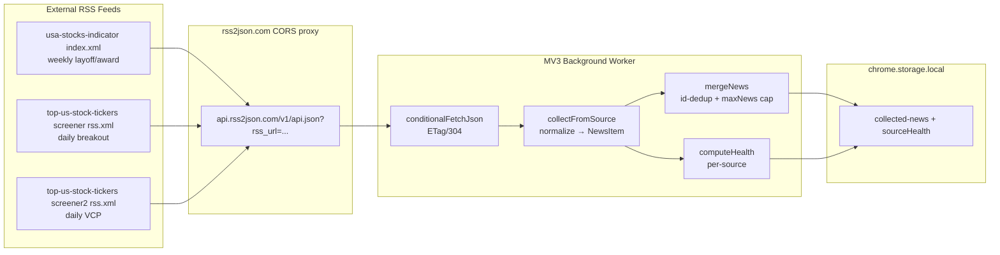

# Phase 11: Stock Indicator Source Collection & Health — Research

**Researched:** 2026-08-25
**Domain:** RSS feed collection, source-health telemetry, browser-extension MV3 background worker
**Confidence:** HIGH

## Summary

Phase 11 adds three stock-indicator RSS feeds as new `NewsSource` values, collected through the existing rss2json.com CORS proxy and tracked for per-source health/staleness. All three feeds are **live and verified** this session: `usa-stocks-indicator` (Hugo RSS, weekly layoff/award reports), `top-us-stock-tickers` breakout screener (daily), and VCP screener-2 (daily). The existing collector (`src/services/collectors/news.ts`), health engine (`src/utils/source-health.ts`), and storage merge (`src/background/merge.ts`) already handle per-source health and per-key caps generically — the phase is primarily **config + type + wiring additions**, not new machinery.

**Primary recommendation:** Add three new `NewsSource` values (`usaStocksIndicator`, `stockScreener`, `stockScreener2`), three `CONFIG.scrape` entries, three `enabledSources` flags defaulting to `true`, and extend the collector `configMap`, background `newsSources` array, and alerts `NEWS_SOURCES` set. **Critically, the collector's item `id` must be derived from the feed `guid` (not `link`) for the two screener feeds**, because every item in those feeds shares the same `link` — using `link` would collapse all items to one via `mergeNews` dedup.

**No new npm packages are required.** This is a code/config-only phase. The rss2json proxy and `conditionalFetchJson` are already in place and already covered by `host_permissions` (`https://api.rss2json.com/*`).

## Phase Requirements

| ID | Description | Research Support |
|----|-------------|------------------|
| SRC-03 | User can see headlines from the three stock-indicator RSS feeds in the news tab | All three feeds verified live; collector + merge + storage already support arbitrary `NewsSource` values; only `id` derivation needs a fix for shared-link feeds |
| SRC-06 | Per-source health/staleness tracking works for the new sources, and unit tests cover collection, deep-merge, and migration | `computeHealth`/`SourceHealthEntry` are source-agnostic; `deepMergeSettings`/`migrateEnabledSources` already backfill new flags generically; test patterns exist in `news-collector.test.ts` |

## Architectural Responsibility Map

| Capability | Primary Tier | Secondary Tier | Rationale |
|------------|-------------|----------------|-----------|
| RSS feed fetch (rss2json proxy) | API / Backend (background worker) | — | MV3 background worker fetches via `conditionalFetchJson`; Firefox MV3 enforces CORS so the rss2json proxy is required |
| Item normalization (title/summary/id) | API / Backend | — | `collectFromSource` maps raw RSS items to `NewsItem` |
| Per-source health/staleness | API / Backend | — | `computeHealth` runs in the worker at collection time; persisted in `CollectionSnapshot` |
| Storage dedup + per-key caps | Database / Storage | — | `mergeNews` in `src/background/merge.ts` enforces `maxNews` cap and id-dedup |
| Source labels/colors | Browser / Client | — | **Phase 12** (SRC-04) — dashboard `NewsFeed`, `SourceHealthIndicator`, `HistoryChart` |
| Settings toggles | Browser / Client | — | **Phase 12/13** (SRC-04/SRC-05) — popup `Settings.tsx` |

## Standard Stack

### Core

No new libraries. The phase reuses the existing, already-verified stack:

| Library | Version | Purpose | Why Standard |
|---------|---------|---------|--------------|
| rss2json.com proxy | — (external service) | CORS-friendly JSON wrapper for RSS feeds | Already used by all 6 existing news sources; `host_permissions` already granted |
| `conditionalFetchJson` | in-repo | ETag/304-cached fetch | Already the collector's only fetch path; mocked in tests |
| `mergeNews` / `capByOldest` | in-repo | id-dedup + per-key cap | Already enforces `CONFIG.storageBudget.maxNews` |
| `computeHealth` | in-repo | staleness/degradation classification | Source-agnostic; no change needed |

### Supporting
| Library | Version | Purpose | When to Use |
|---------|---------|---------|-------------|
| Vitest | existing | Unit tests | `news-collector.test.ts` additions |

### Alternatives Considered
| Instead of | Could Use | Tradeoff |
|------------|-----------|----------|
| rss2json proxy | Direct `fetch()` of RSS XML | CORS-blocked in Firefox MV3 background workers — not viable |
| `guid`-based item id | `link`-based id | `link` is shared across all items in the screener feeds → dedup collapse |

**Installation:** none. No `npm install` required.

**Version verification:** N/A — no new packages. All dependencies are in-repo or external services already in use.

## Package Legitimacy Audit

> No external packages are installed by this phase. The only external dependency is the rss2json.com CORS proxy, already in use by the existing 6 news sources and already covered by `host_permissions` (`src/manifest.config.ts:174`). No package-legitimacy gate applies.

**Packages removed due to [SLOP] verdict:** none
**Packages flagged as suspicious [SUS]:** none

## Architecture Patterns

### System Architecture Diagram



**Trace the primary use case:** each feed → rss2json proxy → `conditionalFetchJson` (304-aware) → `collectFromSource` normalizes items → `computeHealth` records per-source outcome → `mergeNews` dedups by id and caps → persisted to `chrome.storage.local`.

### Recommended Project Structure
No new files/folders required. Changes are edits to existing files:
```
src/
├── config/index.ts          # +3 CONFIG.scrape entries (rssUrl + url)
├── types/index.ts           # +3 NewsSource values; +3 enabledSources flags + DEFAULT_SETTINGS
├── services/collectors/news.ts  # +3 configMap entries; id-from-guid for screener sources
├── background/index.ts      # +3 newsSources pushes
├── background/alerts.ts     # +3 NEWS_SOURCES entries
└── (Phase 12) dashboard + popup labels/colors
```

### Pattern 1: Source-agnostic collector extension
**What:** The collector already maps `NewsSource → { rssUrl }` via `configMap` and normalizes items generically. Adding a source is a data addition, not a code change.
**When to use:** Every new RSS source.
**Example (existing pattern, `src/services/collectors/news.ts:122`):**
```typescript
const configMap: Record<NewsSource, { rssUrl: string }> = {
  bbc: CONFIG.scrape.bbc,
  cnn: CONFIG.scrape.cnn,
  yahoo: CONFIG.scrape.yahoo,
  googleFinance: CONFIG.scrape.googleFinance,
  seekingalpha: CONFIG.scrape.seekingalpha,
  investing: CONFIG.scrape.investing,
};
```

### Pattern 2: Settings deep-merge backfill
**What:** `deepMergeSettings`/`migrateEnabledSources` iterate `DEFAULT_SETTINGS.enabledSources` and backfill missing flags to `true` without overwriting explicit user preferences.
**When to use:** Any new `enabledSources` flag. **No change needed** — adding the 3 flags to `DEFAULT_SETTINGS` automatically makes them backfill for existing users (Phase 13 covers the migration tests).

### Anti-Patterns to Avoid
- **Using `link` as the item id for shared-link feeds:** the two screener feeds return the same `link` (`.../index.html`, `.../screener2.html`) for every item. `id: ${source}:${link}` would collapse all items to one via `mergeNews`'s `Map` dedup. **Use the feed `guid`** (unique per date, e.g. `.../data/screener?date=2026-08-25`) for these sources.
- **Adding the new sources to `isGoogleNewsSource`:** that branch strips a `" - Source"` suffix from titles. The new feeds are not Google News; the screener titles use `—` (em-dash) and `usa-stocks-indicator` titles use ` - ` (hyphen) with a date suffix. Do **not** add them to that list — keep their titles verbatim.
- **Storing the full CDATA HTML table as `summary`:** the screener descriptions are large HTML `<table>` blocks. The existing `replace(/<[^>]*>/g, '')` strips tags but leaves a huge wall of text. Use the `title` as the headline and either omit `summary` or truncate it.

## Don't Hand-Roll

| Problem | Don't Build | Use Instead | Why |
|---------|-------------|-------------|-----|
| RSS→JSON CORS proxy | Custom proxy/server | rss2json.com | Violates the 100% client-side constraint; already in use |
| Conditional/304 fetch | Custom cache | `conditionalFetch` | Already handles ETag/Last-Modified + storage persistence |
| Per-source health | Custom health tracker | `computeHealth` + `SourceHealthEntry` | Already source-agnostic; records itemCount/consecutiveFailures/lastError |
| Storage dedup + caps | Custom merge | `mergeNews` + `capByOldest` | Already enforces `maxNews` and id-dedup |

**Key insight:** This phase is a **data/config extension** of an existing, well-tested pipeline. The only genuinely new logic is the `id` derivation for shared-link feeds.

## Common Pitfalls

### Pitfall 1: Item id collision on shared-link feeds (CRITICAL)
**What goes wrong:** All items from `stockScreener` (and `stockScreener2`) share the same `link` (`https://ozkanpakdil.github.io/top-us-stock-tickers/index.html` / `screener2.html`). The collector builds `id: ${source}:${link}`, so every item gets the **same id**. `mergeNews` uses a `Map` keyed by id → only **one** item survives per source.
**Why it happens:** The feeds use a static landing-page link for every dated report; uniqueness lives in `guid`, not `link`.
**How to avoid:** Derive the id from `guid` when present, falling back to `link`. For these sources use `guid` (e.g. `.../data/screener?date=2026-08-25`).
**Warning signs:** News tab shows only 1 headline per screener source despite the feed having many items.

### Pitfall 2: `isGoogleNewsSource` suffix stripping
**Scenario:** If the new sources are added to the `isGoogleNewsSource` list, `usa-stocks-indicator` titles like `"Recent Tech Layoffs Stock Report - 2026-08-23"` would have the date suffix stripped.
**Why it happens:** The branch strips `" - Source"` suffixes intended for Google News results.
**How to avoid:** Keep the new sources **out** of `isGoogleNewsSource`. The date suffix in the title is informative and should be preserved.
**Warning signs:** Screener/indicator headlines lose their date.

### Pitfall 3: Huge HTML-table summaries
**Scenario:** The screener `description` CDATA contains large HTML tables. Stripping tags yields a massive text blob as `summary`, bloating storage and the news feed.
**Why it happens:** `item.description?.replace(/<[^>]*>/g, '').trim()` removes tags but not content.
**How to avoid:** Use the `title` as the headline; set `summary` to `undefined` (or a short truncated excerpt) for these sources. The `title` already encodes date, hit count, and top ticker.

## Code Examples

### Verified feed item structures (fetched this session)

**usa-stocks-indicator** (`https://ozkanpakdil.github.io/usa-stocks-indicator/index.xml`):
```xml
<item>
  <title>Recent Tech Layoffs Stock Report - 2026-08-23</title>
  <link>https://ozkanpakdil.github.io/usa-stocks-indicator/posts/layoffs-2026-08-23/</link>
  <pubDate>Sun, 23 Aug 2026 00:32:02 +0000</pubDate>
  <guid>https://ozkanpakdil.github.io/usa-stocks-indicator/posts/layoffs-2026-08-23/</guid>
  <description>...HTML tables...</description>
</item>
```

**Breakout screener** (`https://ozkanpakdil.github.io/top-us-stock-tickers/data/screener/rss.xml`):
```xml
<item>
  <title>US Stock Breakout Screener — 2026-08-25 — 22 hits — top: XPON (155.25)</title>
  <link>https://ozkanpakdil.github.io/top-us-stock-tickers/index.html</link>
  <description><![CDATA[<table>...Symbol/Score/Close/Day%/Vol Ratio/Emp/Industry...</table>]]></description>
  <guid isPermaLink="false">https://ozkanpakdil.github.io/top-us-stock-tickers/data/screener?date=2026-08-25</guid>
  <pubDate>Tue, 25 Aug 2026 00:00:00 GMT</pubDate>
</item>
```

**VCP screener-2** (`https://ozkanpakdil.github.io/top-us-stock-tickers/data/screener2/rss.xml`):
```xml
<item>
  <title>VCP Screener-2 — Volatility Contraction Pattern — 2026-08-25 — 1478 hits — 4 VCP — top: AGNCM (36.38)</title>
  <link>https://ozkanpakdil.github.io/top-us-stock-tickers/screener2.html</link>
  <description><![CDATA[<HTML>...Symbol/Score/Rules/Close/Mkt Cap/VCP...</table>]]></description>
  <guid isPermaLink="false">https://ozkanpakdil.github.io/top-us-stock-tickers/data/screener2?date=2026-08-24</guid>
  <pubDate>Mon, 24 Aug 2026 00:00:00 GMT</pubDate>
</item>
```

### Recommended `id` derivation (fix for Pitfall 1)
```typescript
// Prefer the feed's unique guid; fall back to link for feeds that lack one.
const id = item.guid?.trim() || link;
return {
  id: `${source}:${id}`,
  // ...
};
```

## State of the Art

| Old Approach | Current Approach | When Changed | Impact |
|--------------|------------------|--------------|--------|
| Direct RSS `fetch()` | rss2json CORS proxy | Existing (Phase 4) | Required for Firefox MV3 CORS |
| `link`-based item id | `guid`-based id for shared-link feeds | This phase | Prevents dedup collapse |

**Deprecated/outdated:**
- None. The existing pipeline is current.

## Assumptions Log

| # | Claim | Section | Risk if Wrong |
|---|-------|---------|---------------|
| A1 | The three feeds will continue to publish on their current cadence (weekly for `usa-stocks-indicator`, daily for the two screeners) | Summary | If cadence changes, staleness thresholds may need tuning — but the 2h `stalenessThresholdMs` is a global default and per-source health already tolerates quiet-but-healthy sources |
| A2 | The `guid` field is always present and unique per item in the screener feeds | Common Pitfalls | If a feed omits `guid`, the `link` fallback would reintroduce the collision — the collector should handle a missing `guid` gracefully |
| A3 | `usa-stocks-indicator` may show as "stale" between weekly updates under the 2h threshold | Health | Acceptable behavior; the source is healthy but quiet. Flag for discuss-phase whether a per-source staleness override is desired (out of scope for Phase 11) |

## Open Questions

1. **Should `usa-stocks-indicator` get a longer staleness threshold?**
   - What we know: it updates weekly; the global `stalenessThresholdMs` is 2h.
   - What's unclear: whether a weekly source showing "stale" between updates is acceptable UX.
   - Recommendation: Accept the 2h global for Phase 11 (SRC-06 only requires correct health/staleness tracking). A per-source threshold is a future enhancement.

2. **Should the screener `summary` be omitted or truncated?**
   - What we know: descriptions are large HTML tables.
   - What's unclear: whether the dashboard wants the table text.
   - Recommendation: Omit `summary` (use `title` as headline) for these sources; revisit in Phase 12 UI.

## Environment Availability

| Dependency | Required By | Available | Version | Fallback |
|------------|------------|-----------|---------|----------|
| rss2json.com proxy | All 3 feeds | ✓ (in use) | — | None (CORS-blocked direct fetch) |
| `usa-stocks-indicator` feed | SRC-03 | ✓ (verified live) | — | — |
| `top-us-stock-tickers` screener feed | SRC-03 | ✓ (verified live) | — | — |
| `top-us-stock-tickers` screener2 feed | SRC-03 | ✓ (verified live) | — | — |
| Bun / Vitest | Tests | ✓ | existing | — |

**Missing dependencies with no fallback:** none — all three feeds verified live this session.

## Validation Architecture

> `workflow.nyquist_validation` is `true` in `.planning/config.json` — this section is required.

### Test Framework
| Property | Value |
|----------|-------|
| Framework | Vitest (existing) |
| Config file | `vitest.config.*` (existing) |
| Quick run command | `bun test tests/unit/news-collector.test.ts` |
| Full suite command | `bun test` |

### Phase Requirements → Test Map
| Req ID | Behavior | Test Type | Automated Command | File Exists? |
|--------|----------|-----------|-------------------|-------------|
| SRC-03 | `collectNews(['usaStocksIndicator'])` returns items with correct `source` + headline | unit | `bun test tests/unit/news-collector.test.ts` | ✅ (extend) |
| SRC-03 | `collectNews(['stockScreener'])` / `['stockScreener2']` return items with unique ids (guid-based) | unit | `bun test tests/unit/news-collector.test.ts` | ✅ (extend) |
| SRC-06 | Health map records `itemCount`/`consecutiveFailures` for new sources | unit | `bun test tests/unit/news-collector.test.ts` | ✅ (extend) |
| SRC-06 | New sources are NOT in `isGoogleNewsSource` (title preserved) | unit | `bun test tests/unit/news-collector.test.ts` | ✅ (extend) |
| SRC-06 | `deepMergeSettings`/`migrateEnabledSources` backfill new flags to `true` | unit | `bun test tests/unit/settings-deep-merge.test.ts` | ✅ (extend) |

### Sampling Rate
- **Per task commit:** `bun test tests/unit/news-collector.test.ts`
- **Per wave merge:** `bun test`
- **Phase gate:** Full suite green before `/gsd-verify-work`

### Wave 0 Gaps
- [ ] Extend `tests/unit/news-collector.test.ts` with the 3 new sources (collection + health + id uniqueness)
- [ ] Extend `tests/unit/settings-deep-merge.test.ts` / `settings-migration.test.ts` with the 3 new flags (Phase 13 covers migration, but the deep-merge backfill test can be added here)

## Security Domain

> `security_enforcement` is `true` in `.planning/config.json` — this section is required.

### Applicable ASVS Categories
| ASVS Category | Applies | Standard Control |
|---------------|---------|-----------------|
| V2 Authentication | no | — (no auth; public feeds) |
| V3 Session Management | no | — |
| V4 Access Control | no | — |
| V5 Input Validation | yes | `NewsItem` normalization in collector; `classifyCategory`; no raw HTML rendered |
| V6 Cryptography | no | — |

### Known Threat Patterns
| Pattern | STRIDE | Standard Mitigation |
|---------|--------|---------------------|
| Malformed/oversized feed description | Tampering | Strip HTML tags; truncate/omit `summary` for table-heavy feeds; `maxNews` cap |
| Feed URL injection | Tampering | URLs are hardcoded in `CONFIG` (not user-supplied) |
| XSS via feed content | Tampering | Headlines/summaries are rendered as text (React escapes); no `dangerouslySetInnerHTML` |

## Sources

### Primary (HIGH confidence)
- **Live feed verification** — fetched all three RSS feeds this session; confirmed item structure (`title`/`link`/`guid`/`pubDate`/`description`).
- **In-repo source-of-truth reads** — `src/services/collectors/news.ts`, `src/config/index.ts`, `src/types/index.ts`, `src/background/index.ts`, `src/background/alerts.ts`, `src/utils/settings.ts`, `src/utils/source-health.ts`, `src/background/merge.ts`, `src/dashboard/components/NewsFeed.tsx`, `src/dashboard/components/SourceHealthIndicator.tsx`, `src/popup/components/Settings.tsx`, `src/manifest.config.ts`, `tests/unit/news-collector.test.ts`.

### Secondary (MEDIUM confidence)
- `.planning/ROADMAP.md`, `.planning/REQUIREMENTS.md` — phase scope and requirement IDs.

### Tertiary (LOW confidence)
- None.

## Metadata

**Confidence breakdown:**
- Standard stack: HIGH — no new packages; reuses verified in-repo pipeline.
- Architecture: HIGH — data-driven extension of existing collector/merge/health.
- Pitfalls: HIGH — the `id` collision is directly verified from the feed `link`/`guid` structure.

**Research date:** 2026-08-25
**Valid until:** 2026-09-24 (feeds are external; re-verify if cadence/structure changes)
