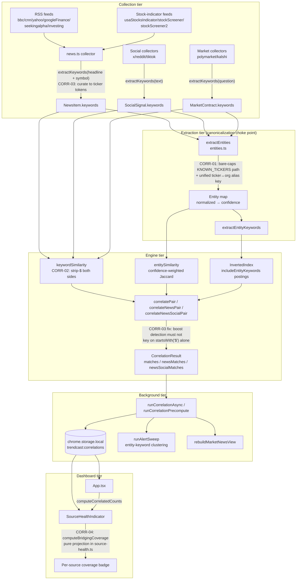

# Phase 14: Ticker/Cashtag Bridging - Research

**Researched:** 2026-02-14
**Domain:** Keyword/entity canonicalization across the TrendCast correlation pipeline (extraction → engine → background → dashboard)
**Confidence:** HIGH

## Summary

Phase 14 makes stock tickers bridge across source boundaries: a social signal saying `$AMZN` must correlate with a news headline saying `AMZN — Breakout` and with a contract mentioning `Amazon`. Today it does not, for three independently verified reasons. **(1) Keyword-form mismatch:** `extractKeywords` keeps the `$` prefix on cashtags (regex `/\$[A-Z]{2,}/g` at `src/utils/keywords.ts:32`), while stock-indicator news items get bare keywords (`extractKeywords(`${stockHeadline} ${symbol}`)` at `src/services/collectors/news.ts:~306`) — `keywordSimilarity` is a plain set-Jaccard over lowercased strings, so `$amzn` ∩ `amzn` = ∅. **(2) Entity dual-canonicalization:** social `$AMZN` produces an entity `{normalized: 'amzn', type: 'ticker', confidence: 0.95}` (cashtag path, `src/utils/entities.ts:202-214`), while the news headline `AMZN — Stock Indicator` matches the KNOWN_ORGS alias `'amzn'` via `matchKeyword` and produces `{normalized: 'amazon', type: 'organization', confidence: 0.8}` — two disjoint entity maps, entitySimilarity = 0. **(3) Entity gap:** bare all-caps tickers not covered by KNOWN_ORGS aliases (XPON, GENB, OABI) produce *no* entity at all — the cashtag regex requires `$`, and both proper-noun regexes (`/\b([A-Z][a-z]+(?:\s+[A-Z][a-z]+)+)\b/g` at `entities.ts:311`, `/\b([A-Z][a-z]{2,})\b/g` at `entities.ts:332`) require mixed case.

The fix shape (validated against every touched file, and consistent with prior-milestone research in `.planning/research/`): canonicalize at **extraction time** (bare ticker form everywhere), add a **KNOWN_TICKERS-gated bare all-caps recognition** path in `extractEntities`, unify the **ticker↔org alias space** so `amzn` and `amazon` resolve to one canonical key, rework the **cashtag boost detection** in `correlatePair` (it currently keys on `startsWith('$')`, which silently disables once keywords go bare), **curate** stock-indicator item keywords down to ticker tokens, and implement **CORR-04 bridging coverage** as a pure projection in `source-health.ts` displayed by `SourceHealthIndicator.tsx`.

**Critical tension (planner decision required):** success criterion 2 says bare `V` must never create matches — but `'v'` **is** in KNOWN_TICKERS (verified verbatim below). The bare-caps recognition path must therefore gate on **length ≥ 2** (regex `\b[A-Z]{2,6}\b`) **and** exclude STOP_WORDS (covers `ALL`, `ON`, `US`, `UK`). Single-letter `V` is excluded by the length gate alone.

**Primary recommendation:** Normalize ticker keyword/entity forms to bare lowercase at the extraction choke points (`keywords.ts`, `entities.ts`), strip `$` inside `keywordSimilarity` to rescue legacy stored data without migration, gate bare-caps ticker recognition on KNOWN_TICKERS ∩ length≥2 ∩ ¬STOP_WORDS, and update the correlation-equivalence oracles in lockstep with production.

## Architectural Responsibility Map

| Capability | Primary Tier | Secondary Tier | Rationale |
|------------|-------------|----------------|-----------|
| Canonical ticker keyword form (bare, lowercase) | Extraction (`src/utils/keywords.ts`) | — | Single choke point: every collector and content script already routes through `extractKeywords`; fixing here covers all 9 verified call sites (kalshi.ts:152, news.ts:306/327, polymarket.ts:90, reddit.ts:113, tiktok.ts:166, x-trends.ts:105, content news/index.ts:82, prediction-markets/index.ts:113/155) |
| Bare all-caps ticker entity recognition + ticker↔org alias unification | Extraction (`src/utils/entities.ts`) | — | `extractEntities` is the only producer of entity maps consumed by `EntityCache`, `extractEntityKeywords`, alerts clustering, and the InvertedIndex `includeEntityKeywords` postings |
| Legacy-data compatibility (stored `$`-prefixed keywords) | Engine compare-time (`src/utils/keywords.ts` `keywordSimilarity`) | — | `chrome.storage.local` already holds correlations/keywords with `$` prefixes; strip-$ at compare time rescues them with zero data migration |
| Cashtag boost detection | Engine (`src/services/engine/correlation.ts`) | — | `correlatePair`'s boost filter is engine-internal logic keyed on keyword string shape |
| Stock-indicator keyword curation (drop noise tokens) | Collection (`src/services/collectors/news.ts`) | — | Only this collector synthesizes headlines from source labels; curation belongs where the synthetic text is built |
| Bridging coverage metric (CORR-04) | Projection (`src/utils/source-health.ts`) | Dashboard (`SourceHealthIndicator.tsx`) | Mirrors the existing pure-projection pattern (`computeCorrelatedCounts`) consumed by the health badges; no schema change to `SourceHealthEntry` |
| InvertedIndex postings | Engine (`src/services/engine/index.ts`) | — | No structural change needed — postings unify automatically once keyword forms are bare; `getIncrementalIndex` hash includes keyword content so caches rebuild |

## Project Constraints (from copilot-instructions.md)

From `.github/copilot-instructions.md` (verbatim directives):

- **NEVER** run `git commit`, `git push`, `git add`, `git stash`, `git tag`, or `npm publish`
- **NEVER** run any command that changes remote state or git history
- Only read-only git commands allowed (`git log`, `git diff`, `git status`, `git show`, `git branch`, `git blame`)
- The user handles ALL commits, pushes, staging, and stash operations
- Make file edits only, then stop

From project conventions (verified in `package.json` and prior research): **Bun is the only package manager** — never `npm`/`npx`. No new runtime dependencies are needed for this phase (zero-dependency verdict from `.planning/research/STACK.md`, re-confirmed: everything is achievable with existing TS stdlib + existing test stack).

<phase_requirements>

## Phase Requirements

| ID | Description | Research Support |
|----|-------------|------------------|
| CORR-01 | Ticker entities unify across cashtag/bare/org-name forms (`$AMZN` ≡ `AMZN` ≡ `Amazon`) | Root cause 2 + 3; fix shape (b) KNOWN_TICKERS-gated bare-caps recognition in `extractEntities` + (c) alias-space unification in `entities.ts`; entity maps must share one canonical key |
| CORR-02 | Cashtag keywords bridge to bare-ticker keywords in `keywordSimilarity` and the InvertedIndex | Root cause 1; fix shape (a) bare form at extraction + strip-$ compare in `keywordSimilarity` for legacy data; superset invariant preserved because `candidateKeywords` and index build both consume the same normalized forms |
| CORR-03 | Stock-indicator news keywords are curated to ticker tokens (drop `stock`, `indicator`, `breakout`, `vcp`, date noise) | Root cause 4; fix shape (e) curation in `news.ts` where the synthetic headline is built; noise tokens dilute Jaccard denominators |
| CORR-04 | Bridging coverage visible per stock source (how many collected items produced ≥1 correlation) | Fix shape (f): pure projection `computeBridgingCoverage(news)` in `source-health.ts` (pattern: `computeCorrelatedCounts`), displayed in `SourceHealthIndicator.tsx` badges; no `SourceHealthEntry` schema change |

</phase_requirements>

## Standard Stack

### Core

**No new packages.** This phase is pure TypeScript refactoring inside the existing pipeline.

| Library | Version | Purpose | Why Standard |
|---------|---------|---------|--------------|
| TypeScript | 5.5 (strict) | All implementation | Already the project language [VERIFIED: package.json] |
| Vitest | 2.0.5 | Unit + equivalence tests | Existing runner; config lives inside `vite.config.ts` `test` block — there is **no separate vitest.config file** [VERIFIED: vite.config.ts] |
| Playwright | (existing) | E2E only — not needed for this phase | Dashboard mocks use bare keyword forms already |

**Installation:**
```bash
# None. Zero new dependencies (prior STACK.md verdict re-confirmed).
# All commands run via Bun:
bun run test        # vitest run
bun run typecheck   # tsc --noEmit
bun run lint        # eslint . --ext .ts,.tsx --max-warnings 0
```

### Alternatives Considered

| Instead of | Could Use | Tradeoff |
|------------|-----------|----------|
| Hand-rolled ticker→company mapping | ticker-mapping npm library | Rejected in prior STACK.md research: adds dependency + bundle weight to a 100% client-side extension with a ~7MB storage budget; KNOWN_TICKERS (48 entries) + KNOWN_ORGS aliases already cover the domain |
| Data migration of stored keywords | Compare-time `$`-stripping in `keywordSimilarity` | Strip-$ rescues legacy stored data with no migration code, no one-shot script, no risk of partial migration; new writes are bare anyway |

## Package Legitimacy Audit

> No external packages are installed in this phase. The audit gate is satisfied vacuously.

| Package | Registry | Age | Downloads | Source Repo | Verdict | Disposition |
|---------|----------|-----|-----------|-------------|---------|-------------|
| (none — zero new dependencies) | — | — | — | — | — | — |

**Packages removed due to [SLOP] verdict:** none
**Packages flagged as suspicious [SUS]:** none

## Architecture Patterns

### System Architecture Diagram



### Recommended Project Structure

No new files required except tests. Touch points:

```
src/
├── utils/
│   ├── keywords.ts          # CORR-02: bare cashtag form OR strip-$ in keywordSimilarity
│   ├── entities.ts          # CORR-01: bare-caps ticker path + alias unification
│   └── source-health.ts     # CORR-04: computeBridgingCoverage projection
├── services/
│   ├── collectors/news.ts   # CORR-03: keyword curation for stock-indicator items
│   └── engine/correlation.ts# boost detection rework (startsWith('$') → ticker-set check)
└── dashboard/components/
    └── SourceHealthIndicator.tsx  # CORR-04: display coverage
tests/unit/
├── correlation-equivalence.test.ts  # oracles updated IN LOCKSTEP
├── correlation.test.ts              # '$btc' keyword-form assertion update
├── index.test.ts                    # cashtag fixture candidate assertions
├── news-collector.test.ts           # curation assertions
└── (new) bridging fixtures/tests    # Wave 0
```

### Pattern 1: Canonical Form at Extraction, Normalization at Compare

**What:** Emit one canonical form (bare lowercase ticker) at extraction time; additionally normalize at compare time (`keywordSimilarity` strips `$`) so legacy stored data keeps working.
**When to use:** Any pipeline where keyword-bearing records are already persisted (chrome.storage.local correlations, snapshots) and a migration would be risky.
**Example:**

```typescript
// Source: verified current code src/utils/keywords.ts:51-57 + proposed strip-$
export function keywordSimilarity(a: string[], b: string[]): number {
  // Normalize both sides: strip leading '$' so legacy stored cashtag
  // keywords ('$btc') bridge to bare forms ('btc') with no data migration.
  const norm = (k: string) => (k.startsWith('$') ? k.slice(1) : k);
  const setA = new Set(a.map(norm));
  const setB = new Set(b.map(norm));
  // ...existing Jaccard intersection/union logic unchanged...
}
```

### Pattern 2: Single Choke Point + Superset Invariant

**What:** The InvertedIndex candidate filter is only sound if the indexed keyword set is a superset of every pairwise-similarity keyword set. Production satisfies this via `candidateKeywords = [...new Set([...keywords, ...extractEntityKeywords(text)])]` feeding both `getIncrementalIndex(items, {includeEntityKeywords:true})` and the naive loop.
**When to use:** Every keyword-form change must be applied in **both** places (or better, in the shared extraction functions both consume).
**Example:**

```typescript
// Source: verified src/services/engine/correlation.ts (superset invariant, "must-have truth #4")
// If extractEntityKeywords starts emitting bare ticker forms, the index
// postings and the pairwise entity-keyword intersection stay in sync
// automatically because both consume the same function output.
const candidateKeywords = [...new Set([...item.keywords, ...extractEntityKeywords(text)])];
```

### Pattern 3: Pure Projection for Derived Health Metrics

**What:** CORR-04 coverage is a pure function of `NewsItem[]` — no storage schema change, no background write path.
**When to use:** Any per-source derived statistic that can be computed from data already in memory at render time.
**Example:**

```typescript
// Source: pattern verified in src/utils/source-health.ts (computeCorrelatedCounts)
// Proposed (CORR-04): coverage = fraction of a source's collected items that
// appear in at least one newsMatch for that source.
export function computeBridgingCoverage(
  news: NewsItem[],
  newsMatches: NewsCorrelationMatch[],
): Partial<Record<NewsSource, { total: number; bridged: number }>> {
  // group news ids by source; count ids present in newsMatches
}
```

### Anti-Patterns to Avoid

- **Fixing in the matcher only:** Normalizing inside `matchKeyword`/`keywordSimilarity` but leaving extraction emitting `$`-forms leaves the InvertedIndex postings and `matchedKeywords` output inconsistent — matches appear/disappear depending on which path scored the pair. Fix at extraction; use compare-time stripping only as the legacy-data bridge.
- **Migrating stored keywords:** A one-shot rewrite of `chrome.storage.local` correlations adds a failure mode (partial writes, version skew across profile sync) for zero benefit over strip-$ compare.
- **Normalizing inside the pairwise loop:** Per-pair string transforms are O(n²) allocations. Normalize once per item at index-build/load time.
- **Changing embedder text inputs:** The embedding cache is keyed by raw text (`EmbeddingStore.cache Map<string, number[]>`); do not "helpfully" normalize text passed to embedding pipelines — it would invalidate every cached vector and change semantic scores.
- **Relaxing equivalence assertions:** The naive oracles in `correlation-equivalence.test.ts` replicate production scoring line-for-line. Update both sides identically; never delete or loosen golden-fixture/D-03 assertions to make tests pass.

## Don't Hand-Roll

| Problem | Don't Build | Use Instead | Why |
|---------|-------------|-------------|-----|
| Ticker universe | A new ticker list or mapping table | Existing `KNOWN_TICKERS` (48 entries, `src/utils/entities.ts:39-48`) + `KNOWN_ORGS` aliases | Already curated, already consumed by cashtag confidence scoring |
| Word-boundary matching for short tokens | Ad-hoc `indexOf` checks | Existing `matchKeyword` (≤4 chars → `\b`-anchored regex, else `text.includes`) | Prevents 'v' matching inside 'nvda'; already handles regex escaping |
| Per-source derived stats | Ad-hoc counting in the component | `source-health.ts` pure-projection pattern (`computeHealth`, `computeCorrelatedCounts`, `computeFetchedCounts`) | Testable, memo-friendly, matches the existing badge data flow |
| Legacy keyword compatibility | Storage migration script | Strip-$ inside `keywordSimilarity` | Zero-risk, idempotent, covers all stored shapes |

**Key insight:** Every "new" capability this phase needs already exists in the codebase in the wrong shape — the work is canonicalization and gating, not new machinery.

## Runtime State Inventory

> Included because this phase changes keyword string forms that are persisted at runtime.

| Category | Items Found | Action Required |
|----------|-------------|------------------|
| Stored data | `chrome.storage.local` keys `trendcast:correlations`, `trendcast:collected-news` (via BUDGET_KEYS `collectedNews`), `trendcast:market-news-view`, `trendcast:alert-history` hold `keywords` arrays that may contain `$`-prefixed cashtag forms written by the current `extractKeywords` [VERIFIED: src/config/index.ts:182-198 — keys verbatim: `correlations='trendcast:correlations'`, `correlationRunHistory='trendcast:corr-run-history'`, `lastCollectionAt='trendcast:last-collection'`, `alertState='trendcast:alert-state'`; BUDGET_KEYS at src/utils/storage.ts:25-38 include `correlations`, `collectedNews`, `marketNewsView`] | **No data migration** — strip-$ compare in `keywordSimilarity` + bare-form index postings make legacy `$`-forms bridge naturally. Old stored matches remain valid; new matches gain bridged pairs. |
| Live service config | None — all feed URLs/config are in-repo (`src/config/index.ts`); no external service stores keyword forms | None — verified by config read |
| OS-registered state | None — browser extension, no OS registrations | None — verified (MV3 extension, no native messaging) |
| Secrets/env vars | None — no API keys anywhere in the pipeline (hard project constraint) | None — verified |
| Build artifacts | None — pure TS source changes; Vite rebuild covers everything; no wasm/model artifacts affected (ML engines untouched) | None — verified |

## Common Pitfalls

### Pitfall 1: One-Sided Normalization
**What goes wrong:** Stripping `$` only in `keywordSimilarity` (or only in extraction) leaves the InvertedIndex postings, `matchedKeywords` output, and entity-keyword intersection on different forms — matches silently drop depending on code path.
**Why it happens:** The keyword form flows through four consumers (pairwise similarity, index build, `candidateKeywords`, `matchedKeywords` intersection) and it's easy to fix one.
**How to avoid:** Canonicalize at extraction (`extractKeywords` emits bare form) so all consumers inherit it; keep strip-$ in `keywordSimilarity` purely for legacy stored data.
**Warning signs:** `index.test.ts` cashtag assertions (`idx.candidates(['$btc'])`) or equivalence `matchedKeywords` diffs fail.

### Pitfall 2: Superset Invariant Break
**What goes wrong:** If pairwise `entitySimilarity` can bridge `amzn↔amazon` but the index postings only contain one form, the indexed candidate set is no longer a superset → matches silently dropped for large inputs (> `TINY_INPUT_THRESHOLD = 2`).
**Why it happens:** Index build and pairwise scoring consume keyword sets through different functions.
**How to avoid:** Both must consume the same `extractEntityKeywords`/`extractKeywords` output; add a test asserting every bridged pair is found via `getIncrementalIndex(..., {includeEntityKeywords:true}).candidates(...)`.
**Warning signs:** Equivalence tests pass on tiny fixtures (naive loop) but golden sets diverge on indexed paths.

### Pitfall 3: Over-Bridging (V / ALL / ON)
**What goes wrong:** Bare-caps recognition turns every headline word into a ticker: `V` (in KNOWN_TICKERS!), `ALL`, `ON`, `US`, `UK` create spurious matches and pollute `matchedKeywords`.
**Why it happens:** `'v'` is verbatim in KNOWN_TICKERS; STOP_WORDS contains `all`, `on`, `us`, `uk`.
**How to avoid:** Gate the bare-caps path on: KNOWN_TICKERS membership **AND** length ≥ 2 **AND** not in STOP_WORDS. Add golden-file assertions: `V` alone → no ticker entity; `ALL CAPS` → no entities; `XPON` (unknown ticker) → no entity.
**Warning signs:** Correlation counts jump on generic headlines; new matches with confidence exactly at the bare-ticker confidence value.

### Pitfall 4: Breaking Equivalence Oracles
**What goes wrong:** `correlation-equivalence.test.ts` oracles (`naiveCorrelatePair` with `startsWith('$')` at ~108/110, `naiveCachedEntitySimilarity`, `naiveCorrelateNewsPair`, `naiveCorrelateNewsSocialPair`) replicate production scoring. If production changes and oracles don't (or vice versa), the equivalence guarantee silently evaporates.
**Why it happens:** Oracles are intentionally independent copies.
**How to avoid:** Update production + all four oracles in the same commit; keep golden-fixture and D-03 edge-case assertions intact; add NEW bridged-match assertions rather than editing old ones.
**Warning signs:** Equivalence tests pass but golden assertions were silently weakened (diff review catches this).

### Pitfall 5: Noise Tokens Diluting Jaccard
**What goes wrong:** Stock-indicator keywords currently include source-label tokens (`stock`, `indicator`, `breakout`, `vcp` — from `STOCK_SOURCE_LABELS` verbatim: `usaStocksIndicator→'Stock Indicator'`, `stockScreener→'Breakout'`, `stockScreener2→'VCP'` [VERIFIED: src/services/collectors/news.ts:60-71]). Even after `$`-bridging, a 6-keyword news set sharing 1 ticker with a 2-keyword signal scores low.
**Why it happens:** `extractKeywords(`${stockHeadline} ${symbol}`)` tokenizes the synthetic label words.
**How to avoid:** CORR-03 curation: for the three stock-indicator sources, set `keywords` to the ticker (plus optional org alias) instead of raw `extractKeywords` output.
**Warning signs:** Bridged matches exist but confidence hovers just under thresholds.

### Pitfall 6: Boost Detection Silently Disabled
**What goes wrong:** `correlatePair` cashtag boost keys on `signal.keywords.filter(k => k.startsWith('$'))` [VERIFIED: src/services/engine/correlation.ts:~186/188]. Once keywords go bare, the boost never fires — a silent behavior regression even though matches still occur.
**Why it happens:** Detection conflated "is a cashtag" with "string starts with $".
**How to avoid:** Detect via KNOWN_TICKERS membership or entity type (`'ticker'`), not string prefix. Mirror the change in `naiveCorrelatePair`.
**Warning signs:** Confidence distributions shift down ~0.3 for ticker pairs after the keyword-form change.

### Pitfall 7: ReDoS from Feed-Derived Patterns
**What goes wrong:** Constructing regexes from RSS-derived keywords (e.g. building a per-ticker regex from feed content) enables catastrophic backtracking on adversarial feed text.
**Why it happens:** Convenient `new RegExp(keyword)`.
**How to avoid:** Keep recognition as fixed literal regexes over the text (current pattern) + string-set membership (`KNOWN_TICKERS.has(...)`); never interpolate feed data into regex sources. (ASVS V5.)
**Warning signs:** Any `new RegExp(` whose argument isn't a compile-time literal.

## Code Examples

### Current vs Bridged Data Flow (`$AMZN` / `AMZN` / `Amazon`)

```typescript
// Source: verified current behavior — src/utils/keywords.ts:32, src/utils/entities.ts:202-214 & 77-99,
// src/services/collectors/news.ts:~306

// CURRENT (broken):
extractKeywords('$AMZN earnings beat')        // → ['$amzn']           (keeps $)
extractKeywords('AMZN — Stock Indicator 2026-08-23 amzn')
// → ['amzn', 'stock', 'indicator', '2026-08-23'→(no: letters-only regex /[a-zA-Z]{3,}/g drops it), 'amzn', 'stock', 'indicator']
//   actually → ['amzn','stock','indicator'] + noise; keywordSimilarity(['$amzn'], ['amzn',...]) = 0

extractEntities('$AMZN earnings beat')
// → [{ normalized: 'amzn', type: 'ticker', confidence: 0.95 }]        (cashtag path)
extractEntities('AMZN — Stock Indicator')
// → [{ normalized: 'amazon', type: 'organization', confidence: 0.8 }] (KNOWN_ORGS alias 'amzn' via matchKeyword)
// entitySimilarity({amzn:0.95}, {amazon:0.8}) = 0  ← dual canonicalization

// BRIDGED (target):
extractKeywords('$AMZN earnings beat')        // → ['amzn']            (bare form)
keywordSimilarity(['$amzn'], ['amzn'])        // → 1 (legacy strip-$ bridge)
extractEntities('$AMZN earnings beat')        // → [{ normalized: 'amzn', type: 'ticker', confidence: 0.95 }]
extractEntities('AMZN — Stock Indicator')     // → [{ normalized: 'amzn', type: 'ticker', ... }]  (unified key)
// entity maps share the 'amzn' key → entitySimilarity > 0 → correlation fires
```

### Bare-Caps Ticker Recognition (CORR-01 core)

```typescript
// Source: proposed; gates verified against KNOWN_TICKERS (entities.ts:39-48) and STOP_WORDS (~146-176)
// KNOWN_TICKERS verbatim (48): 'aapl','msft','googl','goog','amzn','nvda','meta','tsla','nflx',
// 'amd','intc','baba','jpm','v','wmt','dis','nke','pypl','sq','shop','coin','hood','sofi','pltr',
// 'mstr','btc','eth','sol','ada','doge','xrp','dot','matic','link','uni','atom','ltc','bch','avax',
// 'shib','pepe','wif','spx','qqq','spy','iwm','dia','vix'
// NOTE: 'v' IS present → bare-caps path MUST require length >= 2.
const BARE_TICKER_RE = /\b([A-Z]{2,6})\b/g;   // mixed-case regexes at entities.ts:311/332 don't see these
// for each match m: if (KNOWN_TICKERS.has(m.toLowerCase()) && !STOP_WORDS.has(m.toLowerCase())) →
//   entity { normalized: m.toLowerCase(), type: 'ticker', confidence: <see Open Questions> }
// 'V' excluded by {2,6}; 'ALL'/'ON'/'US' excluded by STOP_WORDS; 'XPON' excluded by KNOWN_TICKERS gate.
```

### CORR-04 Coverage Projection

```typescript
// Source: pattern verified — src/utils/source-health.ts computeCorrelatedCounts; types at src/types/index.ts:92-124
// NewsSource union verbatim (types/index.ts:92-101):
// 'bbc'|'cnn'|'yahoo'|'googleFinance'|'seekingalpha'|'investing'|'usaStocksIndicator'|'stockScreener'|'stockScreener2'
// SourceHealthEntry verbatim (types/index.ts:107-122):
// { lastFetchedAt: number; itemCount: number; consecutiveFailures: number; lastError?: string; lastUnchanged?: boolean }
export function computeBridgingCoverage(
  news: NewsItem[],
  newsMatches: NewsCorrelationMatch[],
): Partial<Record<NewsSource, { total: number; bridged: number }>> {
  const bridgedIds = new Set(newsMatches.map((m) => m.news.id));
  const acc: Partial<Record<NewsSource, { total: number; bridged: number }>> = {};
  for (const item of news) {
    const e = (acc[item.source] ??= { total: 0, bridged: 0 });
    e.total += 1;
    if (bridgedIds.has(item.id)) e.bridged += 1;
  }
  return acc;
}
// Display: SourceHealthIndicator.tsx already receives correlatedCounts via App.tsx:427-429/742-744 —
// add a parallel prop; tooltip shows "bridged/total".
```

## State of the Art

| Old Approach | Current Approach | When Changed | Impact |
|--------------|------------------|--------------|--------|
| Inline keyword-overlap candidate filters per engine | Shared `InvertedIndex` + `getIncrementalIndex` with content-hash cache key | Phase 8 (prior milestone) | Keyword-form changes automatically propagate to index caches — no stale-index risk [VERIFIED: tests/unit/index.test.ts PERF-02 rebuild test] |
| Naive O(n²) loops everywhere | Index below `TINY_INPUT_THRESHOLD=2`, naive above | Prior milestone | Bridging must preserve superset invariant only for the indexed path |
| `$`-prefixed cashtag keywords | Bare canonical form (this phase) | — | Unifies social/news/market keyword spaces; legacy data bridged at compare time |

**Deprecated/outdated:**
- `startsWith('$')` as a cashtag detector: becomes dead logic once keywords are bare — must be replaced, not left dormant.

## Assumptions Log

| # | Claim | Section | Risk if Wrong |
|---|-------|---------|---------------|
| A1 | Bare-caps recognition gating on length ≥ 2 + STOP_WORDS exclusion is sufficient to satisfy the "bare `V` never matches" criterion (single-letter excluded by length; `ALL`/`ON`/`US` by STOP_WORDS) | Common Pitfalls 3 / Code Examples | If planner prefers a different mechanism (e.g. removing `'v'` from KNOWN_TICKERS), the gate design changes; removing `'v'` would also disable `$V` cashtag confidence boost — needs user confirmation |
| A2 | Canonical entity key for the ticker↔org unification is the bare ticker (`amzn`), with org-name entities mapping into it when an alias collides | Architecture Patterns | If the planner prefers org-name canonical form (`amazon`), stock-indicator curation and alias tables invert; either works but must be chosen once |
| A3 | Confidence value for bare-caps ticker entities should sit between cashtag (0.95) and hashtag (0.6) — recommendation 0.85 | Open Questions | Wrong value shifts match volumes; easily tuned later, but the equivalence oracles must mirror whatever is chosen |
| A4 | Stock-indicator curation should emit ticker-only keywords (dropping even org aliases) for maximum Jaccard precision | Open Questions | If org aliases are kept, noise returns slightly; if dropped, org-name contracts lose news matches unless alias unification (A2) covers them via entities |
| A5 | Dates like `2026` are currently NOT extracted (letters-only `/[a-zA-Z]{3,}/g` plain-word regex) — CORR-03's mention of `2026` refers to not *introducing* date tokens via curation, not to adding date extraction | Summary / CORR-03 | If dates were expected as keywords, curation scope changes; verified current regex drops them |

## Open Questions (RESOLVED)

All four questions were resolved during planning; the adopted decisions are recorded below and are implemented verbatim in the plans (OQ1 → 14-01 Task 1, OQ2 → 14-02 Task 1, OQ3 → 14-02 Task 2, OQ4 → 14-01 Task 2).

1. **Bare-only vs dual-form keyword emission — RESOLVED: bare-only + strip-$ in `keywordSimilarity`**
   - What we know: `extractKeywords` cashtag regex `/\$[A-Z]{2,}/g` keeps `$`; fixtures (`cashtagOnlyContract` keywords `['$btc']`) and `correlation.test.ts:17-20` (`extractKeywords('$BTC to $100k soon')` → toContain `'$btc'`) lock the current form.
   - What's unclear: emit bare form only (update fixtures + tests), or emit both forms (no test churn but double postings)?
   - **Adopted:** bare-only + strip-$ in `keywordSimilarity`; update the 3 fixture/test sites. Dual-form pollutes `matchedKeywords` display (dashboard chips render `#`-prefixed slices at NewsFeed.tsx:114-122, CorrelationPanel.tsx:1024-1026, HypeFeed.tsx:117-119).

2. **Org-alias keywords on stock-indicator items — RESOLVED: ticker-only keywords + entity unification**
   - What we know: curation can emit `['amzn']` or `['amzn','amazon']`.
   - What's unclear: whether org-name contracts (e.g. a Polymarket contract keywordized to `amazon`) should match stock-indicator items via keywords or only via the unified entity space.
   - **Adopted:** ticker-only keywords + rely on entity unification (CORR-01) for org-name bridging — keeps keyword space minimal.

3. **Bridging coverage storage shape — RESOLVED: compute at render, no persistence**
   - What we know: pure projection from `news` + `newsMatches` needs no persistence; `SourceHealthEntry` schema stays untouched.
   - What's unclear: whether the planner wants coverage persisted (e.g. inside the correlations payload) for history, or computed at render.
   - **Adopted:** compute at render (App.tsx already passes `correlations?.newsMatches`); persist only if UAT shows a need.

4. **Confidence for bare-caps ticker entities — RESOLVED: 0.85, mirrored in oracle fixtures**
   - What we know: existing ladder — cashtag 0.95, crypto 0.9, person 0.85, org 0.8, hashtag 0.6, topic 0.3.
   - What's unclear: exact value (A3 recommends 0.85).
   - **Adopted:** 0.85; mirrored in `naiveCachedEntitySimilarity` fixtures (oracle lockstep in the same task).

## Environment Availability

| Dependency | Required By | Available | Version | Fallback |
|------------|------------|-----------|---------|----------|
| Bun | All script running (hard project constraint) | ✓ | 1.4.0 | — |
| Vitest | Unit + equivalence tests | ✓ | 2.0.5 | — |
| tsc | `bun run typecheck` | ✓ | 5.5.x (via devDep) | — |
| ESLint | `bun run lint` (--max-warnings 0) | ✓ | (devDep) | — |
| External services/CLIs | — | none required | — | — |

**Missing dependencies with no fallback:** none
**Missing dependencies with fallback:** none

## Validation Architecture

### Test Framework

| Property | Value |
|----------|-------|
| Framework | Vitest 2.0.5 (config inside `vite.config.ts` `test` block: `{ globals: true, environment: 'jsdom', exclude: ['node_modules','dist','tests/e2e/**','tests/screenshots/**'] }` — no separate vitest.config) [VERIFIED: vite.config.ts] |
| Config file | `vite.config.ts` (test block) |
| Quick run command | `bun run test` (=`vitest run`) |
| Full suite command | `bun run test` + `bun run typecheck` + `bun run lint` |

Baseline verified this session: **30 files / 360 tests passed**, typecheck clean.

### Phase Requirements → Test Map

| Req ID | Behavior | Test Type | Automated Command | File Exists? |
|--------|----------|-----------|-------------------|-------------|
| CORR-01 | `$AMZN`/`AMZN`/`Amazon` produce one canonical entity; bare `V`/`ALL`/`ON` produce none; `XPON` (unknown) produces none | unit | `bun run test -- tests/unit/correlation-equivalence.test.ts` + new bridging test file | ❌ Wave 0 (new file) |
| CORR-02 | `keywordSimilarity(['$amzn'],['amzn']) > 0`; index candidates unify `$btc`/`btc` postings | unit | `bun run test -- tests/unit/correlation.test.ts tests/unit/index.test.ts` | ✅ (update assertions) + ❌ Wave 0 (new cases) |
| CORR-03 | Stock-indicator items carry ticker-only keywords; noise tokens absent | unit | `bun run test -- tests/unit/news-collector.test.ts` | ✅ (extend: 'xpon'/'amzn' assertions at lines 296/329 remain, add noise-absence asserts) |
| CORR-04 | `computeBridgingCoverage` counts bridged/total per source; badge renders | unit | `bun run test -- tests/unit/source-health.test.ts` | ❌ Wave 0 (extend existing file) |
| REG (implicit) | Equivalence oracles match production after changes; golden + D-03 assertions intact | unit | `bun run test -- tests/unit/correlation-equivalence.test.ts` | ✅ (update oracles in lockstep) |

### Sampling Rate

- **Per task commit:** `bun run test` (full unit suite — fast, <30s)
- **Per wave merge:** `bun run test && bun run typecheck && bun run lint`
- **Phase gate:** full suite green before `/gsd-verify-work`

### Wave 0 Gaps

- [ ] New bridging test file (e.g. `tests/unit/ticker-bridging.test.ts`) — covers CORR-01/02 golden cases: `$AMZN`↔`AMZN`↔`Amazon` unify; `V`/`ALL`/`ON`/`XPON` produce no ticker entities; `keywordSimilarity(['$btc'],['btc']) === 1`
- [ ] Extend `tests/unit/source-health.test.ts` with `computeBridgingCoverage` cases — covers CORR-04
- [ ] Extend `tests/unit/news-collector.test.ts` with keyword-curation assertions — covers CORR-03
- [ ] No framework install needed — Vitest already configured

## Security Domain

### Applicable ASVS Categories

| ASVS Category | Applies | Standard Control |
|---------------|---------|-----------------|
| V2 Authentication | no | N/A — 100% client-side, no auth surface |
| V3 Session Management | no | N/A |
| V4 Access Control | no | N/A — no privileged APIs beyond extension storage |
| V5 Input Validation | **yes** | All feed-derived text flows through fixed literal regexes; keyword recognition must use string-set membership (`KNOWN_TICKERS.has()`), never `new RegExp(feedData)` |
| V6 Cryptography | no | N/A |

### Known Threat Patterns for This Stack

| Pattern | STRIDE | Standard Mitigation |
|---------|--------|---------------------|
| ReDoS via feed-derived regex construction | Tampering / DoS | Fixed literal regexes only (`/\b([A-Z]{2,6})\b/g` etc.); set membership for ticker lookup |
| Unvalidated string used as storage/index key | Tampering | Keep the existing typed pattern: `SourceHealth = Partial<Record<NewsSource, SourceHealthEntry>>` with the in-repo comment "Never index with an unvalidated string (ASVS V5 input validation)" [VERIFIED: src/types/index.ts:124]; CORR-04 projection must key off the `NewsSource` union, not raw strings |
| Keyword injection into dashboard chips / export CSV | Tampering | Existing rendering paths escape via React; export joins with `' | '` — no new injection surface introduced by form changes |

## Sources

### Primary (HIGH confidence)
- `src/utils/keywords.ts` (full read) — cashtag regex line 32 `/\$[A-Z]{2,}/g`, plain-word regex line 36 `/[a-zA-Z]{3,}/g`, `keywordSimilarity` lines 51-57
- `src/utils/entities.ts` (full read) — KNOWN_TICKERS lines 39-48, KNOWN_ORGS 77-99, STOP_WORDS ~146-176, `matchKeyword` 184-191, cashtag path 202-214, hashtag 218, proper-noun 311, single-cap 332, exports
- `src/services/engine/correlation.ts` (full read) — constants (MIN_CONFIDENCE 0.75, MIN_CONFIDENCE_ENTITY_MATCH 0.35, CASHTAG_BOOST 0.3, ENTITY_WEIGHT 0.65, KEYWORD_WEIGHT 0.35), boost detection ~186/188, `candidateKeywords` superset, EntityCache
- `src/services/engine/index.ts` (full read) — InvertedIndex, TINY_INPUT_THRESHOLD=2, MAX_DISTINCT_KEYWORDS=10_000, content-hash cache key
- `src/services/collectors/news.ts` (full read) — STOCK_SOURCE_LABELS, extractStockSymbols regexes, keyword derivation ~306, health recording
- `src/utils/source-health.ts`, `src/types/index.ts` (92-124, 230-340), `src/config/index.ts` (175-270), `src/utils/storage.ts` (20-60), `src/background/alerts.ts` (235-300), `src/background/index.ts` (correlation run paths), `src/dashboard/components/SourceHealthIndicator.tsx`, `src/dashboard/App.tsx` (427-429, 742-744), `src/services/engine/ml/{ner,embedding}.ts` (isolation checks)
- `tests/unit/` — fixtures.ts, correlation-equivalence.test.ts, correlation.test.ts, index.test.ts, news-collector.test.ts, correlation-threshold.test.ts, source-health.test.ts, embedding/ner/llm/sentiment-equivalence.test.ts (isolation checks), export.test.ts, alerts.test.ts, cross-source-alerts.test.ts, settings tests
- `.planning/research/{STACK,FEATURES,ARCHITECTURE,PITFALLS,SUMMARY}.md` — prior-milestone fix-shape and pitfall analysis, cross-checked against source

### Secondary (MEDIUM confidence)
- None needed — no external libraries or APIs involved.

### Tertiary (LOW confidence)
- None.

## Metadata

**Confidence breakdown:**
- Standard stack: HIGH — zero new dependencies; existing toolchain verified via baseline run
- Architecture: HIGH — every touched file read in full this session; fix shape validated against all four consumers of keyword forms
- Pitfalls: HIGH — each pitfall traced to a specific verified code site (boost detection, oracle lockstep, V-in-KNOWN_TICKERS)
- Test impact: HIGH — all affected test files read in full; baseline 360/360 green

**Research date:** 2026-02-14
**Valid until:** 2026-03-14 (stable — pure in-repo refactoring, no fast-moving external deps)