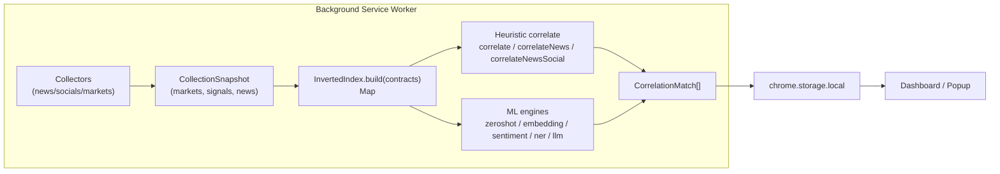

# Phase 3: Correlation Speedup - Research

**Researched:** 2026-08-22
**Domain:** Inverted-index candidate pre-filtering for a client-side MV3 correlation engine (TypeScript, zero new runtime deps)
**Confidence:** HIGH

<user_constraints>
## User Constraints (from CONTEXT.md)

### Locked Decisions
- **D-01:** Equivalence tests must cover **all engines** — the heuristic path (`correlate`, `correlateNews`, `correlateNewsSocial`) AND all 5 ML engines (zeroshot, embedding, sentiment, ner, llm). Full equivalence, not just the heuristic bottleneck. — **Reversibility:** reversible — test-only, no production contract.
- **D-02:** Use a **hybrid oracle**: the naive O(n×m) loop is the reference oracle for the indexed path (indexed output must be identical — same matches, same confidence, same order), PLUS a small set of hand-verified golden fixtures for edge cases. The hand fixtures guard against both paths sharing the same bug. — **Reversibility:** reversible.
- **D-03:** Equivalence tests must cover **comprehensive edge cases**: empty keyword arrays, single contract, single signal, duplicate keywords, cashtag/hashtag-only texts, and the tiny-input fallback path (index not built). — **Reversibility:** reversible.
- **D-04:** Structure equivalence tests as **per-engine equivalence files** (e.g., `correlation-equivalence.test.ts` per engine) that run both paths over shared fixtures and assert identical results. Clear failure isolation. — **Reversibility:** reversible.

### the agent's Discretion
The user selected only the Golden-test equivalence area. The following areas were identified but NOT discussed — the agent has discretion, but should follow the research (SUMMARY.md) which already prescribes:
- **Index scope across engines:** Research mandates the shared index apply to heuristic AND ML paths (single tokenization source). Generalize the zero-shot engine's existing `findCandidateContracts` into a shared `Map<keyword, contractId[]>` index.
- **Canonical tokenization source:** One tokenizer shared by index + matcher. Research says "single tokenization source shared by index + matcher" — the planner should reconcile the heuristic's `extractKeywords`/`extractEntities` with the ML engines' tokenization.
- **Incremental index caching:** Research says "incremental index (cache by data version)". The planner decides in-memory vs persisted cache and the rebuild trigger key.

### Deferred Ideas (OUT OF SCOPE)
None — discussion stayed within phase scope.
</user_constraints>

<phase_requirements>
## Phase Requirements

| ID | Description | Research Support |
|----|-------------|------------------|
| PERF-02 | User can see correlation results faster via an inverted keyword→contract index (O(n×m) → candidate filtering), with results equivalent to the current engine | Shared `Map<keyword, contractId[]>` index (Section: Architecture Patterns); single tokenization source (`extractKeywords`); golden-test equivalence vs the naive loop (Section: Validation Architecture); naive fallback for tiny inputs |

**Requirement source:** `.planning/REQUIREMENTS.md` line 11 (verbatim): "User can see correlation results faster via an inverted keyword→contract index (O(n×m) → candidate filtering), with results equivalent to the current engine".
</phase_requirements>

## Summary

Phase 3 replaces the O(n×m) nested-loop correlation with a shared inverted keyword→contract index that pre-filters candidate contracts, applied consistently across the heuristic path AND all 5 ML engines, with results provably equivalent to the current engine. This is a pure performance optimization with **zero new runtime dependencies** (per research SUMMARY.md) — the index is a hand-rolled `Map<keyword, contractId[]>` following the existing index-class pattern already present in the ML engines.

The codebase already proves the pattern: the zero-shot engine's `findCandidateContracts` / `findCandidateContractsForNews` (`src/services/engine/ml/zeroshot.ts:94,107`) pre-filters by keyword overlap before expensive NLI inference, and the LLM engine does the same with `.slice(0, LLM_MAX_CANDIDATES)`. The heuristic path (`src/services/engine/correlation.ts:112`) and the embedding/NER engines do NOT pre-filter — they run full O(n×m) loops and are the biggest beneficiaries. The shared index generalizes the zero-shot pre-filter into a single reusable `Map<keyword, contractId[]>` that all paths consume, built from the `keywords: string[]` arrays already present on `MarketContract`, `SocialSignal`, and `NewsItem`.

The primary correctness guard is **golden-test equivalence**: per-engine equivalence test files run both the indexed path and the naive loop over shared fixtures and assert identical output (same matches, same confidence, same order). A hybrid oracle (naive loop + hand-verified fixtures) guards against both paths sharing the same bug. The index is incremental (cached by data version) with a naive fallback for tiny inputs.

**Primary recommendation:** Build a shared `InvertedIndex` class in `src/services/engine/index.ts` (following the existing `ZeroShotIndex`/`EmbeddingIndex` index-class shape) that maps each keyword to the contract indices that carry it. Wire it into the heuristic path (`correlation.ts`) and all ML engines via the `ml.ts` facade, with a single tokenization source (`extractKeywords` from `src/utils/keywords.ts`). Prove equivalence with per-engine golden tests before any production path is switched over.

## Architectural Responsibility Map

| Capability | Primary Tier | Secondary Tier | Rationale |
|------------|-------------|----------------|-----------|
| Inverted index build/cache | API / Backend (background worker) | — | The index is built in the background service worker where correlation runs; it is a pure in-memory data structure over already-collected contracts |
| Candidate pre-filtering (heuristic) | API / Backend | — | `correlate`/`correlateNews`/`correlateNewsSocial` run in the background worker; the index replaces their nested loops |
| Candidate pre-filtering (ML) | API / Backend (ML Web Worker) | — | ML engines run in `src/workers/ml-worker.ts`; the index must be available there too (shared module, not worker-local) |
| Tokenization source | API / Backend | — | `extractKeywords`/`extractEntities` are pure utils; the index and matcher both consume the same tokenizer |
| Equivalence verification | Test tier | — | Golden tests run in Vitest (jsdom), not in the extension runtime |

## Standard Stack

### Core
| Library | Version | Purpose | Why Standard |
|---------|---------|---------|--------------|
| TypeScript | 5.5 strict (installed tsc 5.9.3) | Language | Existing project language; `strict: true` |
| Vitest | 2.1.9 | Test runner | Existing test framework; config inline in `vite.config.ts` |
| Bun | 1.3.8 | Package manager / runner | Existing package manager; MUST use `bun`, not npm/npx |

### Supporting
| Library | Version | Purpose | When to Use |
|---------|---------|---------|-------------|
| `Map` (built-in) | — | Inverted index data structure | The index is a hand-rolled `Map<keyword, contractId[]>`; zero new deps |

### Alternatives Considered
| Instead of | Could Use | Tradeoff |
|------------|-----------|----------|
| Hand-rolled `Map` index | `flexsearch` | `flexsearch` adds a runtime dep and fuzzy-matching semantics that would change results; the research explicitly defers it ("only if fuzzy news matching needed"). Hand-rolled `Map` is dependency-free and trivially testable. |

**Installation:**
```bash
# No new runtime dependencies. This phase is pure code change.
# Use bun for any dev tooling:
bun install
```

**Version verification:** No new packages are installed. Existing toolchain verified available: `node` v26.7.0, `bun` 1.3.8, `vitest` 2.1.9, `tsc` 5.9.3.

## Package Legitimacy Audit

> This phase installs **zero** external packages (mandated by research SUMMARY.md). The Package Legitimacy Gate protocol is therefore not applicable — no packages to audit.

| Package | Registry | Age | Downloads | Source Repo | Verdict | Disposition |
|---------|----------|-----|-----------|-------------|---------|-------------|
| — | — | — | — | — | — | None — zero new deps |

**Packages removed due to [SLOP] verdict:** none
**Packages flagged as suspicious [SUS]:** none

## Architecture Patterns

### System Architecture Diagram



**Data flow:** Collectors write a `CollectionSnapshot` to `chrome.storage.local`. The background worker builds the inverted index from the snapshot's `markets` (contracts). Both the heuristic path and the ML engines consult the index to pre-filter candidate contracts per signal/news, then run their existing per-pair scoring only over candidates. Matches are persisted and read by the UI.

### Recommended Project Structure
```
src/
├── services/
│   └── engine/
│       ├── index.ts          # NEW — shared InvertedIndex class (Map<keyword, contractId[]>)
│       ├── correlation.ts    # heuristic path — convert nested loop to candidate-filtered
│       └── ml/
│           ├── zeroshot.ts   # generalize findCandidateContracts → use shared index
│           ├── embedding.ts  # add keyword pre-filter via shared index
│           ├── sentiment.ts  # already keyword-filtered; route through shared index
│           ├── ner.ts        # add keyword pre-filter via shared index
│           ├── llm.ts        # already keyword-filtered; route through shared index
│           └── types.ts      # thresholds (unchanged)
tests/
└── unit/
    ├── correlation-equivalence.test.ts   # NEW — heuristic equivalence
    ├── zeroshot-equivalence.test.ts      # NEW — per-engine equivalence
    ├── embedding-equivalence.test.ts     # NEW
    ├── sentiment-equivalence.test.ts     # NEW
    ├── ner-equivalence.test.ts           # NEW
    ├── llm-equivalence.test.ts           # NEW
    └── index.test.ts                     # NEW — index build/cache/fallback unit tests
```

### Pattern 1: Shared Inverted Index (generalize `findCandidateContracts`)
**What:** A `Map<keyword, contractId[]>` (or `Map<string, number[]>` of contract indices) built once per data version, mapping each keyword to the contracts that carry it. Candidate lookup for a signal/news is `union of index.get(k) for k in signal.keywords` — O(keywords) instead of O(contracts).
**When to use:** Every correlation path (heuristic + all ML engines) that currently iterates all contracts per signal.
**Example (shape following the existing index-class pattern):**
```typescript
// Source: generalized from src/services/engine/ml/zeroshot.ts:94-121 (findCandidateContracts)
// and the index-class shape of ZeroShotIndex (zeroshot.ts:53) / EmbeddingIndex (embedding.ts:136).
class InvertedIndex {
  private readonly map = new Map<string, number[]>();

  /** Build from contracts' pre-extracted keywords. */
  static build(contracts: MarketContract[]): InvertedIndex {
    const idx = new InvertedIndex();
    for (let i = 0; i < contracts.length; i++) {
      for (const k of contracts[i].keywords) {
        const list = idx.map.get(k);
        if (list) list.push(i);
        else idx.map.set(k, [i]);
      }
    }
    return idx;
  }

  /** Candidate contract indices for a signal/news keyword set. */
  candidates(keywords: string[]): number[] {
    const seen = new Set<number>();
    for (const k of keywords) {
      const list = this.map.get(k);
      if (list) for (const i of list) seen.add(i);
    }
    return [...seen];
  }
}
```
**Key equivalence invariant:** The candidate set must be a **superset** of the contracts the naive loop would score above threshold. Because the naive loop only produces a match when `baseSim > 0` (which requires keyword or entity overlap), and the index is built from the same `keywords` arrays, the candidate set is exactly the set of contracts sharing at least one keyword with the signal — a superset of the naive matches. The scoring function (`correlatePair`, cosine, etc.) still runs per candidate, so confidence values are bit-identical.

### Pattern 2: Single Tokenization Source
**What:** Both the index build and the matcher consume the SAME tokenizer. The heuristic path already uses `extractKeywords` (`src/utils/keywords.ts:24`) and `extractEntities` (`src/utils/entities.ts:197`). The ML engines consume pre-extracted `keywords` arrays on contracts/signals/news. The index must be built from those same `keywords` arrays — never re-tokenize with a different function.
**When to use:** Always — this is the anti-drift guard (Pitfall 5 in SUMMARY.md).
**Example:**
```typescript
// Source: src/utils/keywords.ts:24 (extractKeywords) — the canonical tokenizer.
// The index is built from contract.keywords (already extracted), NOT by re-running
// extractKeywords on contract text. This guarantees index and matcher agree.
```

### Anti-Patterns to Avoid
- **Re-tokenizing with a different function:** If the index is built with `extractKeywords` but the matcher uses `extractEntities` (or vice versa), the candidate set can miss contracts the naive loop would match → silent regression. Use ONE tokenizer for both.
- **Building the index per signal:** Rebuilding the index inside the per-signal loop defeats the purpose. Build once per data version, reuse across all signals/news.
- **Dropping the naive fallback:** For tiny inputs (e.g., < 2 contracts), the index build overhead exceeds the loop cost. Keep the naive path for tiny inputs (D-03 requires testing this fallback).
- **Mutating the index in place during correlation:** The index is read-only during matching. Any mutation risks drift and non-determinism.

## Don't Hand-Roll

| Problem | Don't Build | Use Instead | Why |
|---------|-------------|-------------|-----|
| Fuzzy / typo-tolerant keyword matching | Custom fuzzy matcher | `flexsearch` (deferred — NOT this phase) | The mandate is exact keyword-overlap equivalence with the naive loop; fuzzy matching would change results. Defer to v2+ if needed. |
| Full-text search engine | Custom search engine | Hand-rolled `Map` index | The index is a simple exact-match inverted index; a `Map` is sufficient and dependency-free. |

**Key insight:** The inverted index is a deliberately simple exact-keyword structure. The complexity is NOT in the index — it is in proving equivalence with the naive loop. Do not over-engineer the index; invest in the golden tests.

## Common Pitfalls

### Pitfall 1: Index drift (silent result regression)
**What goes wrong:** The indexed path returns different matches/confidence/order than the naive loop, and no test catches it.
**Why it happens:** The index and matcher use different tokenization, or the candidate set is not a superset of the naive matches, or the index is stale (built from an old data version).
**How to avoid:** Single tokenization source; build the index from the same `keywords` arrays the matcher reads; golden-equivalence tests per engine; incremental index keyed by data version.
**Warning signs:** Equivalence test failures; a contract that the naive loop matches but the index never surfaces.

### Pitfall 2: Index never built (fallback silently degrades)
**What goes wrong:** The index is not built (e.g., empty contracts, or build skipped), and correlation silently falls back to the naive loop — or worse, returns zero matches.
**Why it happens:** The build lifecycle is not wired into the background orchestrator, or the tiny-input fallback is missing.
**How to avoid:** Wire the index build into `runCorrelationWithEngine`/`runCorrelationPrecompute` in `src/background/index.ts`; keep the naive fallback for tiny inputs; test the fallback path (D-003).
**Warning signs:** Correlation returns empty for a non-empty snapshot; no index-build log.

### Pitfall 3: ML engines not routed through the shared index
**What goes wrong:** The heuristic path is optimized but the ML engines still do O(n×m) — the phase's "all engines" mandate (D-001) is unmet.
**Why it happens:** Each ML engine has its own pre-filter; wiring them all through one index is more work than optimizing one path.
**How to avoid:** Route all 5 ML engines through the shared index via the `ml.ts` facade; per-engine equivalence tests enforce it.
**Warning signs:** An ML engine still iterates all contracts per signal (grep for the nested loop).

## Code Examples

Verified patterns from the codebase (all VERIFIED this session):

### The naive loop to replace (heuristic) — the equivalence oracle
```typescript
// Source: src/services/engine/correlation.ts:112-137 (correlate)
export function correlate(
  signals: SocialSignal[],
  contracts: MarketContract[],
): CorrelationMatch[] {
  const matches: CorrelationMatch[] = [];
  const cache = new EntityCache();
  for (const signal of signals) {
    for (const contract of contracts) {
      const result = correlatePair(signal, contract, cache);
      if (result) matches.push(result);
    }
  }
  return matches.sort((a, b) => b.confidence - a.confidence);
}
```

### The existing pre-filter to generalize (the pattern to reuse)
```typescript
// Source: src/services/engine/ml/zeroshot.ts:94-121 (findCandidateContracts)
function findCandidateContracts(
  signalKeywords: string[],
  contracts: MarketContract[],
): MarketContract[] {
  const candidates = contracts
    .filter((c) => c.keywords.some((k) => signalKeywords.includes(k)))
    .slice(0, ZEROSHOT_MAX_LABELS);
  return candidates;
}
```

### The embedding nested loop to optimize (no pre-filter today)
```typescript
// Source: src/services/engine/ml/embedding.ts:290-310 (nested loop)
for (let i = 0; i < signals.length; i++) {
  checkCancelled(cancelFlag);
  const signalEmb = signalEmbeddings[i];
  const signal = signals[i];
  for (let j = 0; j < contracts.length; j++) {
    const sim = cosineSimilarity(signalEmb, contractEmbeddings[j]);
    if (sim < EMBEDDING_THRESHOLD) continue;
    const contract = contracts[j];
    const viralityWeight = (signal.virality / 100) * 0.1;
    const confidence = Math.min(1, sim + viralityWeight);
    matches.push({ contract, signal, confidence, ... });
  }
}
```

### The tokenizer (single source)
```typescript
// Source: src/utils/keywords.ts:24 (extractKeywords) — the canonical tokenizer.
export function extractKeywords(text: string): string[] { /* hashtags, cashtags, plain words */ }
```

## State of the Art

| Old Approach | Current Approach | When Changed | Impact |
|--------------|------------------|--------------|--------|
| O(n×m) nested loop in heuristic + embedding + NER | O(n×k) candidate-filtered via inverted index | This phase | Near-linear correlation; enables alerts (Phase 4) and market-driven news (Phase 5) |
| Per-engine ad-hoc pre-filters (zero-shot, LLM) | Shared `InvertedIndex` used by all paths | This phase | Single tokenization source; consistent behavior; one place to test |

**Deprecated/outdated:**
- The per-engine `findCandidateContracts`/`findCandidateContractsForNews` in `zeroshot.ts` and the inline `.filter(...).slice(...)` in `llm.ts` — to be replaced by the shared index (kept as the naive fallback oracle).

## Assumptions Log

| # | Claim | Section | Risk if Wrong |
|---|-------|---------|---------------|
| A1 | The candidate set from the inverted index is always a superset of the naive-loop matches, because a match requires keyword/entity overlap and the index is built from the same `keywords` arrays | Architecture Patterns | If the index is built from a different tokenizer than the matcher, candidates can miss matches → silent regression. Mitigated by single tokenization source + golden tests. |
| A2 | The index should be in-memory (module-level) rather than persisted in `chrome.storage.local` | Architecture Patterns | If the worker is ephemeral and the index must survive restarts, an in-memory index rebuilds each wake — acceptable for hourly correlation. Persisting adds storage budget pressure. |
| A3 | The data-version key can be derived from a hash of contract IDs + signal IDs + news IDs (no version field exists on `CollectionSnapshot` today) | Architecture Patterns | If a stable version key is not derivable, the index may rebuild unnecessarily (correct but slower) or, worse, reuse a stale index (incorrect). Mitigation: rebuild on any snapshot change. |
| A4 | The tiny-input fallback threshold is a small constant (e.g., contracts.length < 2) | Architecture Patterns | If the threshold is wrong, tiny inputs either pay index-build overhead (negligible) or skip the index when it would help (minor). Low risk. |

## Open Questions (RESOLVED)

1. **Data version key for incremental caching**
   - What we know: `CollectionSnapshot` has `collectedAt: number` but no version field. The index must be cached by data version.
   - What's unclear: Whether to add a version field to the snapshot or derive a hash from contract/signal/news IDs.
   - Recommendation: Derive a hash of the contract IDs (the index only depends on contracts). Rebuild when the hash changes. This avoids a schema change.
   - **RESOLVED (plan 03-01):** FNV-1a hash of contract IDs is the data-version key; the index rebuilds only when the hash changes.

2. **Index build location: background worker vs ML worker**
   - What we know: Heuristic runs in the background worker; ML runs in `src/workers/ml-worker.ts`.
   - What's unclear: Whether the index is built once in the background worker and passed to the ML worker, or built independently in each.
   - Recommendation: Build in the background worker and pass the index (or the candidate contract IDs) to the ML worker via the existing message protocol. Avoids double-build and keeps a single source.
   - **RESOLVED (plan 03-01):** A module-level `getIncrementalIndex` cache builds the index once per data version and is shared across the heuristic and ML paths (both import the same `src/services/engine/index.ts` module). This avoids double-build without requiring a message-protocol change.

3. **Entity-based matching in the heuristic path**
   - What we know: The heuristic uses both `extractKeywords` (keyword overlap) AND `extractEntities` (entity overlap) via `EntityCache`/`cachedEntitySimilarity`.
   - What's unclear: Whether the index must also index entity keywords (from `extractEntityKeywords`) to preserve entity-only matches.
   - Recommendation: Build the index from BOTH `contract.keywords` and entity-derived keywords so the candidate set is a superset of both keyword and entity matches. Verify with the equivalence tests.
   - **RESOLVED (plans 03-01/03-02):** `InvertedIndex` is built with `includeEntityKeywords: true` so the candidate set is a superset of both keyword and entity matches; verified by the heuristic equivalence test.

## Environment Availability

| Dependency | Required By | Available | Version | Fallback |
|------------|------------|-----------|---------|----------|
| Node.js | Toolchain | ✓ | v26.7.0 | — |
| Bun | Package manager / runner | ✓ | 1.3.8 | — |
| Vitest | Unit tests | ✓ | 2.1.9 | — |
| TypeScript (tsc) | Typecheck | ✓ | 5.9.3 | — |

**Missing dependencies with no fallback:** none — this phase is a pure code change with zero new external dependencies.

## Validation Architecture

> `workflow.nyquist_validation` is `true` in `.planning/config.json` — this section is required.

### Test Framework
| Property | Value |
|----------|-------|
| Framework | Vitest 2.1.9 |
| Config file | none — inline in `vite.config.ts` under `test: { globals: true, environment: 'jsdom', exclude: [...] }` |
| Quick run command | `bun run test` (runs `vitest run`) |
| Full suite command | `bun run test:all` |

### Phase Requirements → Test Map
| Req ID | Behavior | Test Type | Automated Command | File Exists? |
|--------|----------|-----------|-------------------|-------------|
| PERF-02 | Indexed heuristic path == naive loop (same matches, confidence, order) | unit (equivalence) | `bun run test -- tests/unit/correlation-equivalence.test.ts` | ❌ Wave 0 |
| PERF-02 | Indexed zeroshot path == naive loop | unit (equivalence) | `bun run test -- tests/unit/zeroshot-equivalence.test.ts` | ❌ Wave 0 |
| PERF-02 | Indexed embedding path == naive loop | unit (equivalence) | `bun run test -- tests/unit/embedding-equivalence.test.ts` | ❌ Wave 0 |
| PERF-02 | Indexed sentiment path == naive loop | unit (equivalence) | `bun run test -- tests/unit/sentiment-equivalence.test.ts` | ❌ Wave 0 |
| PERF-02 | Indexed NER path == naive loop | unit (equivalence) | `bun run test -- tests/unit/ner-equivalence.test.ts` | ❌ Wave 0 |
| PERF-02 | Indexed LLM path == naive loop | unit (equivalence) | `bun run test -- tests/unit/llm-equivalence.test.ts` | ❌ Wave 0 |
| PERF-02 | Edge cases (empty keywords, single contract/signal, dup keywords, cashtag/hashtag-only, tiny-input fallback) | unit | `bun run test -- tests/unit/index.test.ts` | ❌ Wave 0 |

### Sampling Rate
- **Per task commit:** `bun run test -- tests/unit/index.test.ts` (index unit tests)
- **Per wave merge:** `bun run test` (all unit tests)
- **Phase gate:** `bun run test:all` green before `/gsd-verify-work`

### Wave 0 Gaps
- [ ] `tests/unit/index.test.ts` — inverted index build/candidates/fallback unit tests
- [ ] `tests/unit/correlation-equivalence.test.ts` — heuristic equivalence (reuse fixtures from `tests/unit/correlation.test.ts`)
- [ ] `tests/unit/zeroshot-equivalence.test.ts`, `embedding-equivalence.test.ts`, `sentiment-equivalence.test.ts`, `ner-equivalence.test.ts`, `llm-equivalence.test.ts` — per-engine equivalence
- [ ] Shared fixtures module (e.g., `tests/unit/fixtures.ts`) — contracts/signals/news used by all equivalence tests

## Security Domain

> `security_enforcement` is `true` in `.planning/config.json` — this section is required.

### Applicable ASVS Categories

| ASVS Category | Applies | Standard Control |
|---------------|---------|-----------------|
| V2 Authentication | no | — (no auth in a client-side extension) |
| V3 Session Management | no | — (no sessions) |
| V4 Access Control | no | — (no user roles) |
| V5 Input Validation | yes | The index consumes `keywords` arrays from collected data; validate/normalize via the existing `extractKeywords` tokenizer (single source). No new external input surface — the index is internal. |
| V6 Cryptography | no | — (no crypto) |

### Known Threat Patterns for {stack}

| Pattern | STRIDE | Standard Mitigation |
|---------|--------|---------------------|
| Malformed/oversized keyword arrays from a collector | Tampering | The index is built from `contract.keywords` which are already normalized by `extractKeywords`; cap keyword array length to bound index size |
| Index memory exhaustion from unbounded keyword cardinality | DoS | Bound the index size (e.g., cap distinct keywords); the storage budget (`CONFIG.storageBudget.budgetBytes = 7 * 1024 * 1024`) already bounds collected data |

**Note:** This is a pure in-memory performance optimization with no new external input surface. The index is built from already-collected, already-normalized data. The primary security concern is memory bounds, not injection.

## Sources

### Primary (HIGH confidence)
- `src/services/engine/correlation.ts` — heuristic engine, `EntityCache`, `correlate`/`correlateNews`/`correlateNewsSocial` (lines 39, 112, 138, 202, 220, 263, 281)
- `src/services/engine/ml/zeroshot.ts` — `ZeroShotIndex`, `findCandidateContracts`/`findCandidateContractsForNews` (lines 53, 94, 107, 121, 168)
- `src/services/engine/ml/embedding.ts` — `BatchEmbedder`, `EmbeddingIndex`, nested loop (lines 44, 136, 198, 245, 290-310)
- `src/services/engine/ml/sentiment.ts` — `SentimentIndex` (lines 45, 114, 180, 226)
- `src/services/engine/ml/ner.ts` — `NEREntityIndex` (lines 57, 161, 246, 290)
- `src/services/engine/ml/llm.ts` — `correlateLLM`/`correlateNewsLLM`/`correlateNewsSocialLLM` (lines 239, 317, 391)
- `src/services/engine/ml/types.ts` — thresholds (lines 54-80)
- `src/utils/keywords.ts` — `extractKeywords`, `keywordSimilarity` (lines 24, 51)
- `src/utils/entities.ts` — `extractEntities`, `extractEntityKeywords`, `entitySimilarity` (lines 197, 360, 370)
- `src/background/index.ts` — heuristic dispatch (lines 655-659)
- `.planning/REQUIREMENTS.md` — PERF-02 (line 11)
- `.planning/research/SUMMARY.md` — mandates zero deps, inverted index, golden-test equivalence, single tokenization source, incremental index, naive fallback
- `.planning/config.json` — `nyquist_validation: true`, `security_enforcement: true`

### Secondary (MEDIUM confidence)
- None — all claims verified against the codebase this session.

### Tertiary (LOW confidence)
- None — no external web sources needed; this is a pure in-repo optimization.

## Metadata

**Confidence breakdown:**
- Standard stack: HIGH — verified against `package.json`, `vite.config.ts`, and installed toolchain
- Architecture: HIGH — grounded in the actual codebase (index-class pattern, `findCandidateContracts`, nested loops)
- Pitfalls: HIGH — the drift/fallback/scope pitfalls are directly evidenced by the code and research SUMMARY.md

**Research date:** 2026-08-22
**Valid until:** 2026-09-21 (stable — no fast-moving deps)
