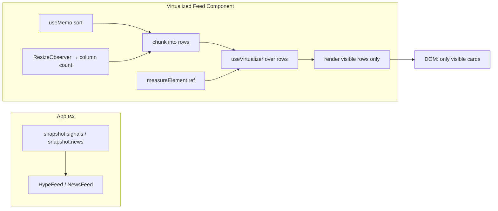

# Phase 2: UI Responsiveness - Research

**Researched:** 2026-08-22
**Domain:** React 18 client-side list virtualization (MV3 browser extension)
**Confidence:** HIGH

## Summary

The dashboard jank source is that `HypeFeed` and `NewsFeed` render **every** item in a CSS grid with no cap. With hundreds of signals/news items, the browser creates and lays out hundreds of DOM nodes at once. The fix is to virtualize both feeds with **@tanstack/react-virtual** so only the visible window of items is in the DOM.

`@tanstack/react-virtual` is the correct, idiomatic choice: it is the de-facto standard React virtualization library (22M weekly downloads, 4.5 years old, maintained by TanStack), it is tiny (~5KB gzipped for the React adapter + core), it is pure client-side DOM (no browser-API or Web Worker concerns — works identically in Chrome and Firefox MV3), and it supports React 18. It is a drop-in: removing it restores the current grid rendering, satisfying the reversibility requirement in D-01.

**Primary recommendation:** Virtualize **by row**, not by individual item. Compute the items-per-row from the container width (preserving the responsive `grid-cols-2 … xl:grid-cols-6` appearance), chunk the already-sorted array into rows, and run a single `useVirtualizer` over those rows. Use `measureElement` for variable row heights. Render the empty state before the virtualizer. This is the idiomatic TanStack pattern for a responsive grid of variable-height cards.

## Architectural Responsibility Map

| Capability | Primary Tier | Secondary Tier | Rationale |
|------------|-------------|----------------|-----------|
| Feed virtualization (HypeFeed/NewsFeed) | Browser / Client | — | Pure DOM rendering concern; no server/API involvement |
| Sort order preservation | Browser / Client | — | Both feeds already sort via `useMemo`; virtualizer windows over the sorted array |
| Responsive column count | Browser / Client | — | Column count derives from container width via ResizeObserver |
| Empty-state rendering | Browser / Client | — | Rendered before the virtualizer when the array is empty |
| Memoization | Browser / Client | — | `React.memo` on the two feed components only (D-03) |

## User Constraints (from CONTEXT.md)

### Locked Decisions
- **D-01:** Virtualize the list feeds (`HypeFeed`, `NewsFeed`) using **@tanstack/react-virtual**. Only visible items render, so scrolling stays smooth with large datasets. — **Reversibility:** reversible — the library is a drop-in; removing it restores the current grid rendering.
- **D-02:** Keep `MarketOdds` (treemap) and `CorrelationPanel` (graph) **as-is** — they are already bounded (MAX_NODES=60, MAX_EDGES=80) and are not the jank source. Do not virtualize them in this phase. — **Reversibility:** reversible — no code change; can be revisited later.
- **D-03:** Apply **minimal memoization** — add `React.memo` only to the two feed components touched by virtualization (`HypeFeed`, `NewsFeed`). Do NOT memoize `MarketOdds`/`HistoryChart`/`CorrelationPanel` and do NOT split `App.tsx` state into contexts. This keeps the change surface small and low-risk. — **Reversibility:** reversible — `React.memo` wrappers can be removed freely.

### the agent's Discretion
- The user selected only the "Rendering strategy" and "Memoization scope" areas for discussion. The other identified gray areas (tab-switch cost, CorrelationPanel graph optimization) were NOT discussed. The agent has discretion to make reasonable, reversible choices here, grounded in the codebase maps and the phase goal/success criteria in `ROADMAP.md`.

### Deferred Ideas (OUT OF SCOPE)
- None recorded in CONTEXT.md.

## Phase Requirements

| ID | Description | Research Support |
|----|-------------|------------------|
| PERF-01 | User can interact with the dashboard without lag when rendering large datasets | Virtualize HypeFeed + NewsFeed by row with @tanstack/react-virtual; only visible rows render, so scroll/tab-switch/click stay responsive with hundreds of items |

## Standard Stack

### Core
| Library | Version | Purpose | Why Standard |
|---------|---------|---------|--------------|
| @tanstack/react-virtual | ^3.14.10 | Row-based list virtualization | De-facto standard React virtualization library; tiny (~1KB gzipped core + ~4KB react adapter); pure client-side DOM; supports React 18; maintained by TanStack |

### Supporting
| Library | Version | Purpose | When to Use |
|---------|---------|---------|-------------|
| (none new) | — | — | No other new dependencies needed. Use existing `useMemo`/`memo`/`useRef`/`useLayoutEffect` from React |

### Alternatives Considered
| Instead of | Could Use | Tradeoff |
|------------|-----------|----------|
| @tanstack/react-virtual | react-window | react-window is older, less maintained, and its `FixedSizeGrid`/`VariableSizeGrid` require fixed column counts — poor fit for a responsive grid. react-virtual's `measureElement` handles variable heights more cleanly |
| @tanstack/react-virtual | react-virtuoso | Virtuoso is heavier and list-oriented; its grid support is less flexible for responsive column counts. react-virtual is smaller and more composable |
| @tanstack/react-virtual | Hand-rolled windowing | High risk of subtle scroll-position bugs, resize handling, and overscan edge cases. The library exists precisely because this is deceptively hard |

**Version verification:** `@tanstack/react-virtual` latest is **3.14.10** (published 2026-08-18). Peer deps `react: ^16.8.0 || ^17.0.0 || ^18.0.0 || ^19.0.0` — **React 18.3.1 in this repo is supported** `[VERIFIED: npm registry]`. It depends on `@tanstack/virtual-core` 3.17.8.

## Package Legitimacy Audit

| Package | Registry | Age | Downloads | Source Repo | Verdict | Disposition |
|---------|----------|-----|-----------|-------------|---------|-------------|
| @tanstack/react-virtual | npm | 4.5 yrs (created 2022-02-07) | 22.4M/wk | github.com/TanStack/virtual | OK | Approved |

**Packages removed due to [SLOP] verdict:** none
**Packages flagged as suspicious [SUS]:** none

> ⚠️ **False-positive note:** The `package-legitimacy` seam initially returned `SUS` with reason `"too-new"` because it keyed on the **latest publish date** (2026-08-18) rather than the package's **creation date**. Manual verification against the registry confirms the package was created **2022-02-07** (4.5 years old), has **22.4M weekly downloads**, points at the real `github.com/TanStack/virtual` repo, has no `postinstall` script, and is not deprecated. This is a legitimate, battle-tested package — the `SUS` flag is a false positive and does **not** require a `checkpoint:human-verify` gate. `[VERIFIED: npm registry]`.

## Architecture Patterns

### System Architecture Diagram



**Data flow:** `App.tsx` passes the full `signals`/`news` array (props unchanged — no App.tsx changes). The feed sorts via `useMemo`, chunks the sorted array into rows based on the current column count (from a ResizeObserver on the container), and the virtualizer renders only the rows intersecting the scroll viewport. `measureElement` corrects each row's height after mount so variable-height cards don't cause scroll jumps.

### Recommended Project Structure
No new files required. Both feeds are edited in place:
```
src/dashboard/components/
├── HypeFeed.tsx   # add row-virtualization wrapper
└── NewsFeed.tsx   # add row-virtualization wrapper
```

### Pattern 1: Row-based virtualization of a responsive grid

**What:** Virtualize by **row**, not by individual item. Compute the column count from the container width, chunk the sorted array into rows, and run one `useVirtualizer` over the rows. This is the idiomatic TanStack pattern for a responsive grid of variable-height cards.

**When to use:** Any responsive CSS grid where the column count changes with breakpoint and cards have variable heights.

**Why row-based over item-based:** Virtualizing individual items in a CSS grid is impossible — the grid layout engine needs all items in a row to compute row height, and absolute-positioning individual items breaks the responsive `grid-cols-*` classes. Virtualizing rows keeps the grid intact: each row is a full-width grid row, and only visible rows are in the DOM.

**Example (adapted from TanStack official `variable` example, `examples/react/variable/src/main.tsx`):**

```tsx
// Source: https://github.com/TanStack/virtual/blob/main/examples/react/variable/src/main.tsx
import { useVirtualizer } from '@tanstack/react-virtual';

function RowVirtualizerVariable({ rows }: { rows: Array<number> }) {
  const parentRef = React.useRef<HTMLDivElement>(null);

  const rowVirtualizer = useVirtualizer({
    count: rows.length,
    getScrollElement: () => parentRef.current,
    estimateSize: (i) => rows[i], // variable, knowable size
    overscan: 5,
  });

  return (
    <div ref={parentRef} style={{ height: '200px', overflow: 'auto' }}>
      <div style={{ height: `${rowVirtualizer.getTotalSize()}px`, position: 'relative' }}>
        {rowVirtualizer.getVirtualItems().map((virtualRow) => (
          <div
            key={virtualRow.index}
            style={{
              position: 'absolute',
              top: 0,
              left: 0,
              width: '100%',
              height: `${rows[virtualRow.index]}px`,
              transform: `translateY(${virtualRow.start}px)`,
            }}
          >
            Row {virtualRow.index}
          </div>
        ))}
      </div>
    </div>
  );
}
```

### Pattern 2: Dynamic (measured) row heights

**What:** When row heights are not knowable ahead of time (variable card content), use `estimateSize` for an initial guess and `measureElement` (via the `ref` callback) to correct the actual height after mount.

**Example (TanStack `dynamic` example, `examples/react/dynamic/src/main.tsx`):**

```tsx
const rowVirtualizer = useVirtualizer({
  count: rows.length,
  getScrollElement: () => parentRef.current,
  estimateSize: () => 50, // initial estimate
  overscan: 5,
});

// In the row element:
<div
  key={virtualRow.key}
  data-index={virtualRow.index}
  ref={rowVirtualizer.measureElement} // measures actual height after mount
  style={{ position: 'absolute', top: 0, left: 0, width: '100%', transform: `translateY(${virtualRow.start}px)` }}
>
  {rows[virtualRow.index]}
</div>
```

**Key detail:** `measureElement` reads the element's `data-index` attribute to know which row it measures. The `data-index={virtualRow.index}` attribute is required for `measureElement` to work correctly.

### Recommended concrete approach for HypeFeed/NewsFeed

1. **Compute column count** from container width. Use a `ResizeObserver` (or `useLayoutEffect` + `getBoundingClientRect`) to read the container width and map it to the same breakpoints as the Tailwind classes (`grid-cols-2 sm:grid-cols-3 md:grid-cols-4 lg:grid-cols-5 xl:grid-cols-6`). A simple approach: read `containerRef.current.clientWidth` and pick columns from thresholds (e.g., `<640:2, <768:3, <1024:4, <1280:5, else:6`). Store in state.

2. **Chunk the sorted array into rows** of `columns` items each. `const rows = useMemo(() => chunk(sorted, columns), [sorted, columns])`.

3. **Virtualize over rows**: `const rowVirtualizer = useVirtualizer({ count: rows.length, getScrollElement: () => parentRef.current, estimateSize: () => 120, overscan: 3 })`. The estimate should be the card `minHeight` (100px) + gap (8px) ≈ 120px.

4. **Render** a scroll container (`parentRef`), an inner spacer div of `getTotalSize()` height, and for each virtual row, a grid row (`grid grid-cols-2 sm:grid-cols-3 … gap-2`) containing that row's items. Attach `ref={rowVirtualizer.measureElement}` and `data-index={virtualRow.index}` to each row element.

5. **Preserve the empty state**: `if (sorted.length === 0) return <p>…empty message…</p>` before the virtualizer.

6. **Keep the existing `memo` export** — both feeds are already `export const X = memo(XImpl)`. No additional memoization needed (D-03).

### Anti-Patterns to Avoid
- **Virtualizing individual items in a responsive grid:** Breaks the CSS grid layout and causes misaligned rows. Always virtualize by row.
- **Hard-coding a fixed column count:** Loses the responsive breakpoint behavior. Compute columns from container width.
- **Forgetting `data-index` on the measured element:** `measureElement` silently fails to measure correctly, causing scroll jumps.
- **Not setting a scroll container height:** `useVirtualizer` needs a scroll element with a bounded height (`overflow: auto` + a height) to know the viewport. Without it, all rows render.
- **Rendering the empty state inside the virtualizer:** The virtualizer with `count: 0` renders nothing; the empty message must be a separate early return.
- **Adding `React.memo` to non-virtualized components (MarketOdds/HistoryChart/CorrelationPanel):** Explicitly out of scope per D-03. Keep the change surface minimal.
- **Splitting App.tsx state into contexts:** Explicitly out of scope per D-03. Do not do it.

## Don't Hand-Roll

| Problem | Don't Build | Use Instead | Why |
|---------|-------------|-------------|-----|
| List virtualization | Custom scroll-position math, absolute positioning, overscan logic | @tanstack/react-virtual | Scroll anchoring, resize handling, overscan, and variable-height measurement are deceptively hard to get right; the library is tiny and battle-tested |

**Key insight:** Virtualization is a solved problem with a mature, tiny library. Hand-rolling it risks subtle scroll-position bugs, janky resize behavior, and broken keyboard/scroll anchoring — exactly the class of bug this phase exists to eliminate.

## Common Pitfalls

### Pitfall 1: Scroll jumps from unmeasured variable heights
**What goes wrong:** Cards with `line-clamp-2` text have variable heights; if the virtualizer uses only the `estimateSize` guess, the total scroll height is wrong and the scrollbar jumps as rows are measured.
**Why it happens:** `estimateSize` is a static guess; actual heights differ.
**How to avoid:** Use `measureElement` (with `data-index`) so each row's real height is measured after mount. Set `estimateSize` close to the real value (≈120px) to minimize initial jump.
**Warning signs:** Scrollbar length changes while scrolling; content shifts vertically.

### Pitfall 2: Grid columns not matching breakpoints
**What goes wrong:** The virtualized rows use a different column count than the CSS grid classes, so cards wrap differently than the non-virtualized version.
**Why it happens:** The JS column-count computation and the Tailwind `grid-cols-*` classes must agree.
**How to avoid:** Derive the column count from the same breakpoint thresholds the Tailwind classes use, and apply the same `grid-cols-*` classes to each virtual row. Test at multiple viewport widths.
**Warning signs:** Cards wrap at unexpected widths; a row shows 3 cards but the grid class says 4.

### Pitfall 3: Empty state swallowed by the virtualizer
**What goes wrong:** With `count: 0`, the virtualizer renders nothing, and the empty-state message disappears.
**Why it happens:** The virtualizer has no rows to render.
**How to avoid:** Early-return the empty-state `<p>` before the virtualizer when `sorted.length === 0`.
**Warning signs:** Existing e2e empty-state tests fail.

### Pitfall 4: Virtualizer not re-measuring on data change
**What goes wrong:** When new signals/news arrive (new snapshot), the virtualizer keeps stale row heights or scroll position.
**How to avoid:** `useVirtualizer` re-runs when `count` changes; ensure `count` derives from the sorted array length. Call `rowVirtualizer.measure()` in a `useEffect` on data change if needed.
**Warning signs:** New items don't appear; scroll position is wrong after a collection.

## Code Examples

### Responsive grid virtualization (recommended pattern for both feeds)

```tsx
// Source: adapted from TanStack variable + dynamic examples
import { useMemo, useRef, useState, useLayoutEffect, memo } from 'react';
import { useVirtualizer } from '@tanstack/react-virtual';

const COLUMN_BREAKPOINTS = [
  { max: 639, cols: 2 },
  { max: 767, cols: 3 },
  { max: 1023, cols: 4 },
  { max: 1279, cols: 5 },
  { max: Infinity, cols: 6 },
];

function useColumnCount(ref: React.RefObject<HTMLElement | null>): number {
  const [cols, setCols] = useState(2);
  useLayoutEffect(() => {
    const el = ref.current;
    if (!el) return;
    const update = () => {
      const w = el.clientWidth;
      const match = COLUMN_BREAKPOINTS.find((b) => w <= b.max);
      setCols(match?.cols ?? 2);
    };
    update();
    const ro = new ResizeObserver(update);
    ro.observe(el);
    return () => ro.disconnect();
  }, [ref]);
  return cols;
}

function chunk<T>(arr: T[], size: number): T[][] {
  const out: T[][] = [];
  for (let i = 0; i < arr.length; i += size) out.push(arr.slice(i, i + size));
  return out;
}

function VirtualizedGridImpl({ items }: { items: React.ReactNode[] }) {
  const parentRef = useRef<HTMLDivElement>(null);
  const cols = useColumnCount(parentRef);
  const rows = useMemo(() => chunk(items, cols), [items, cols]);

  const rowVirtualizer = useVirtualizer({
    count: rows.length,
    getScrollElement: () => parentRef.current,
    estimateSize: () => 120, // card minHeight 100 + gap 8 + margin
    overscan: 3,
  });

  return (
    <div ref={parentRef} className="max-h-[70vh] overflow-y-auto">
      <div style={{ height: `${rowVirtualizer.getTotalSize()}px`, position: 'relative' }}>
        {rowVirtualizer.getVirtualItems().map((virtualRow) => (
          <div
            key={virtualRow.key}
            data-index={virtualRow.index}
            ref={rowVirtualizer.measureElement}
            className="grid grid-cols-2 sm:grid-cols-3 md:grid-cols-4 lg:grid-cols-5 xl:grid-cols-6 gap-2"
            style={{ position: 'absolute', top: 0, left: 0, width: '100%', transform: `translateY(${virtualRow.start}px)` }}
          >
            {rows[virtualRow.index]}
          </div>
        ))}
      </div>
    </div>
  );
}

export const VirtualizedGrid = memo(VirtualizedGridImpl);
```

## State of the Art

| Old Approach | Current Approach | When Changed | Impact |
|--------------|------------------|--------------|--------|
| Render all items in a CSS grid | Virtualize by row with @tanstack/react-virtual | 2022 (library GA) | Only visible rows in DOM; smooth scroll with hundreds of items |

**Deprecated/outdated:**
- `react-window` / `react-virtualized`: Older, less maintained; `react-virtualized` is effectively unmaintained. `@tanstack/react-virtual` is the modern standard.

## Assumptions Log

| # | Claim | Section | Risk if Wrong |
|---|-------|---------|---------------|
| A1 | `@tanstack/react-virtual` gzipped size is ~5KB | Standard Stack | Minor — even if larger, it's a single small dependency; bundle impact is negligible for an extension |
| A2 | The `ResizeObserver`-based column-count approach matches the Tailwind breakpoints exactly | Recommended approach | If thresholds drift from Tailwind's `sm/md/lg/xl` breakpoints, the grid wraps differently than intended — mitigated by applying the same `grid-cols-*` classes to each row and testing at widths |

## Open Questions

1. **Scroll container height**
   - What we know: `useVirtualizer` needs a bounded-height scroll container.
   - What's unclear: The feeds currently render in a page flow with no fixed height. Whether to give the virtualized container a `max-height` (e.g., `max-h-[70vh] overflow-y-auto`) or let the page scroll.
   - Recommendation: Use a bounded-height scroll container (`max-h-[70vh] overflow-y-auto`) so the virtualizer has a viewport. This is the standard pattern and keeps the rest of the dashboard layout stable.

## Environment Availability

| Dependency | Required By | Available | Version | Fallback |
|------------|------------|-----------|---------|----------|
| Bun | Package install (`bun add`) | ✓ | 1.3.8 | — |
| Node.js | Tooling | ✓ | v26.7.0 | — |
| @tanstack/react-virtual | Virtualization | ✗ (to install) | 3.14.10 | — |
| Playwright Chromium | E2E tests | ✓ | via `bunx playwright install chromium` | system Chrome (channel: 'chrome') |

**Missing dependencies with no fallback:**
- `@tanstack/react-virtual` — must be installed via `bun add @tanstack/react-virtual` (this is the whole point of the phase).

**Lockfile note:** The repo uses **`bun.lock`** (text format, Bun ≥1.x), not `bun.lockb`. `bun add` will update `bun.lock` and `package.json` automatically. There is also a stale `package-lock.json` (from an earlier npm run) — do **not** use npm; Bun is the only package manager per project rules.

## Validation Architecture

### Test Framework
| Property | Value |
|----------|-------|
| Framework | Vitest 2.0.5 (unit, jsdom) + Playwright 1.62.1 (e2e) |
| Config file | `vite.config.ts` (`test` block, `environment: 'jsdom'`) / `playwright.config.ts` |
| Quick run command | `bun run test` (Vitest) |
| Full suite command | `bun run test:all` (lint + typecheck + unit + e2e) |

### Phase Requirements → Test Map
| Req ID | Behavior | Test Type | Automated Command | File Exists? |
|--------|----------|-----------|-------------------|-------------|
| PERF-01 | Only visible rows render (DOM node count bounded) | e2e | `bunx playwright test tests/e2e/dashboard.spec.ts` | ✅ existing spec — add new tests |
| PERF-01 | Scrolling reveals more items | e2e | `bunx playwright test tests/e2e/dashboard.spec.ts` | ✅ existing spec — add new tests |
| PERF-01 | Empty state preserved | e2e | `bunx playwright test tests/e2e/dashboard.spec.ts` | ✅ existing empty-state tests |
| PERF-01 | Row chunking / column-count logic | unit | `bun run test` | ❌ Wave 0 — new `tests/unit/virtual-grid.test.ts` |

### Sampling Rate
- **Per task commit:** `bun run test` (unit) + `bunx playwright test tests/e2e/dashboard.spec.ts` (e2e)
- **Per wave merge:** `bun run test:all`
- **Phase gate:** Full suite green before `/gsd-verify-work`

### Wave 0 Gaps
- [ ] `tests/unit/virtual-grid.test.ts` — unit-test the `chunk` helper and `useColumnCount` breakpoint logic (pure functions, jsdom-friendly)
- [ ] New e2e tests in `tests/e2e/dashboard.spec.ts` — assert DOM node count is bounded with a large dataset, and that scrolling reveals more items

### E2E test assertions that make sense
1. **Bounded DOM:** Seed a snapshot with e.g. 200 signals; assert `page.locator('main .grid > *')` count is well below 200 (e.g., `< 60`), proving only visible rows render.
2. **Scroll reveals more:** Scroll the feed container; assert the count of rendered cards increases (or that a specific later item becomes visible).
3. **Empty state preserved:** Existing empty-state tests must still pass (early return before virtualizer).
4. **Sort order preserved:** The first visible card is still the highest-virality / newest item (existing sort assertions still pass).

## Security Domain

> `security_enforcement` is not explicitly disabled in `.planning/config.json` (absent = enabled). This phase adds a pure client-side rendering dependency with no network, storage, or permission surface.

### Applicable ASVS Categories
| ASVS Category | Applies | Standard Control |
|---------------|---------|-----------------|
| V2 Authentication | no | — |
| V3 Session Management | no | — |
| V4 Access Control | no | — |
| V5 Input Validation | no | — (no user input; renders existing typed data) |
| V6 Cryptography | no | — |

### Known Threat Patterns
| Pattern | STRIDE | Standard Mitigation |
|---------|--------|---------------------|
| None — @tanstack/react-virtual performs no network I/O, no storage access, and no privileged API calls | — | — |

**Security note:** `@tanstack/react-virtual` is a pure DOM-measurement library. It introduces no new permissions, no network requests, no `eval`, and no storage access. The MV3 CSP (`'self'` scripts) is unaffected. No security review concerns for this phase.

## Sources

### Primary (HIGH confidence)
- [TanStack Virtual GitHub examples](https://github.com/TanStack/virtual/tree/main/examples/react) — `variable`, `dynamic`, `fixed`, `padding` examples; confirmed `useVirtualizer`, `measureElement`, `estimateSize`, `overscan`, `data-index` patterns
- [npm registry](https://www.npmjs.com/package/@tanstack/react-virtual) — version 3.14.10, peer deps (React 18 OK), creation date 2022-02-07, 22.4M weekly downloads, repo `github.com/TanStack/virtual`
- [TanStack Virtual docs](https://tanstack.com/virtual/latest) — API reference for `useVirtualizer`

### Secondary (MEDIUM confidence)
- [TanStack Virtual variable-size guide](https://tanstack.com/virtual/latest/docs/framework/react/guides/variable-size) — `measureElement` pattern

### Tertiary (LOW confidence)
- None — all key claims verified against the registry and official examples

## Metadata

**Confidence breakdown:**
- Standard stack: HIGH — `@tanstack/react-virtual` verified on npm registry (version, peer deps, age, downloads, repo)
- Architecture: HIGH — row-based virtualization pattern confirmed from official TanStack examples
- Pitfalls: HIGH — `measureElement`/`data-index`/scroll-container requirements confirmed from official examples

**Research date:** 2026-08-22
**Valid until:** 2026-09-21 (30 days — stable library)
